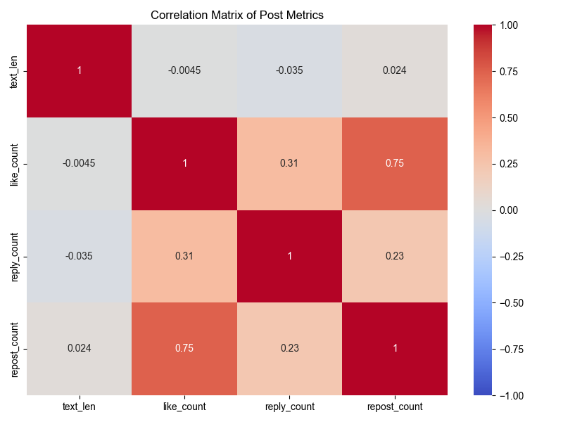

# 資料集分布分析報告

> 本報告針對經過篩選（移除 >100k 粉絲大帳號）後的資料集進行基礎統計與分布分析，旨在了解資料的集中趨勢、離散程度與不平等狀況。

## 1. 資料集概覽

- **總貼文數**：8,773 篇
- **總用戶數**：95 位
- **資料特性**：
    - 已排除粉絲數 > 100,000 的極端大帳號。
    - 數據呈現高度的長尾分佈特性（Long-tail distribution）。

## 2. 核心指標統計表

下表彙整了用戶層級與貼文層級的關鍵統計量：

| 指標 | 單位 | 樣本數 | 平均值 (Mean) | 中位數 (Median) | 標準差 (Std) | 最大值 (Max) | 變異係數 (CV) | 基尼係數 (Gini) |
| :--- | :--- | :--- | :--- | :--- | :--- | :--- | :--- | :--- |
| **用戶粉絲數** | 人 | 95 | 2,901 | 792 | 4,620 | 23,451 | 1.59 | **0.692** |
| **用戶發文量** | 篇 | 95 | 92.4 | 76 | 68.6 | 266 | 0.74 | 0.419 |
| **貼文長度** | 字數 | 8,773 | 124.3 | 84 | 114.8 | 1,132 | 0.92 | 0.468 |
| **按讚數** | 次 | 8,773 | 76.7 | **8** | 553.4 | 20,000 | **7.21** | **0.881** |
| **回覆數** | 次 | 8,773 | 10.1 | 1 | 53.5 | 3,666 | 5.29 | 0.880 |
| **轉發數** | 次 | 8,773 | 2.1 | 0 | 19.9 | 891 | 9.62 | **0.958** |

### 統計名詞解釋
- **變異係數 (CV)**：標準差除以平均值，數值越大代表資料越離散。按讚數的 CV 高達 7.21，顯示互動數據極度不穩定。
- **基尼係數 (Gini)**：介於 0 到 1，數值越大代表越不平等（0為完全平等，1為完全集中）。轉發數的 Gini 高達 0.958，代表絕大多數轉發集中在極少數貼文。

---

## 3. 詳細分布分析

### 3.1 用戶生態
- **粉絲分布**：呈現明顯的 M 型化或右偏分布。雖然平均粉絲數近 3,000，但有一半以上的用戶粉絲數低於 800 人。
- **活躍度**：用戶發文量相對均勻（Gini 0.419），中位數為 76 篇，顯示這批樣本用戶屬於持續活躍的創作者群體。

*(上圖：用戶粉絲數分布 - 對數座標)*

### 3.2 貼文內容形式
- **篇幅偏好**：平均 124 字，中位數 84 字。
- **分布狀況**：大多數貼文落在 43-172 字之間（P25-P75），顯示「短篇圖文」或「心情隨筆」是此平台的內容主流。

### 3.3 互動成效（Engagement）
互動數據展現了極端的「貧富差距」：

- **按讚數**：平均 76.7 讚，但中位數僅 8 讚。這意味著**少數爆文（Outliers）拉高了整體平均值**。
- **擴散難度**：轉發數（Reposts）的中位數為 0，代表超過一半的貼文完全沒有被轉發。轉發是此資料集中最稀缺的互動資源。
- **極端值**：最高按讚數達 20,000，是中位數的 2,500 倍。

*(上圖：按讚數箱型圖 - 已隱藏極端離群值以顯示分佈主體)*

### 3.4 相關性矩陣
各指標間的相關係數（Correlation）顯示：

- **按讚與轉發**：通常具有高度正相關。
- **字數與互動**：需觀察相關係數，通常字數與互動的直接線性相關性較低，代表內容品質比長短更重要（呼應 Basic Analysis 的結論）。

## 4. 結論

1. **數據解讀建議**：由於互動數據極度右偏（Right-skewed），在評估成效時，**中位數（Median）** 會比平均值更能代表「一般貼文」的預期表現。
2. **創作者樣貌**：此資料集主要由「微型與中小型創作者」組成（Median Followers ~800），具有穩定的發文習慣。
3. **爆文效應**：互動數據的高變異係數提醒我們，社群演算法具有強烈的「贏家全拿」特性，少數貼文獲得了絕大部分的流量。

---

### 附錄：分析執行
- 腳本位置：`scripts/dataset_analysis.py`
- 產出圖表：`scripts/outputs/plots/dataset-analysis/`
- 統計報表：`scripts/tables/dataset_stats_summary.csv`
