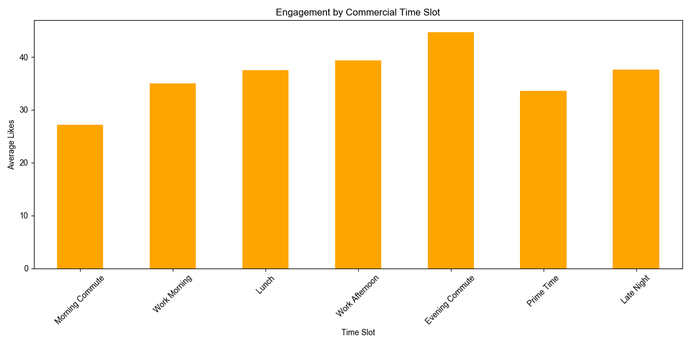

# 基礎指標分析

> 分析時間、內容形式與互動成效的關係

## 本報告適用對象

- **起步期創作者 (0-1k 粉)**：正在摸索 Threads 經營方向
- **成長期創作者 (1k-10k 粉)**：希望突破瓶頸、提升互動
- **專業經營者 (10k+ 粉)**：優化內容策略、建立品牌
- **行銷從業者**：需要為客戶制定 Threads 內容策略

---

## 一、時間維度分析

### 1.1 每小時成效

**最佳發文時段（Top 5）：**

| 時段  | 平均按讚數 | 中位數按讚 | 文章數 | 創作者數 |
| ----- | ---------- | ---------- | ------ | -------- |
| 03:00 | 51.7       | 15.0       | 119    | 22       |
| 01:00 | 48.9       | 13.0       | 208    | 47       |
| 18:00 | 48.0       | 9.0        | 486    | 77       |
| 09:00 | 43.8       | 10.0       | 305    | 58       |
| 17:00 | 43.5       | 8.0        | 471    | 73       |


**關鍵發現：**

- 🌙 **凌晨時段 (01:00-03:00)** 平均互動最高，且中位數也高 (13-15 讚)
- 🌆 **傍晚時段 (17:00-18:00)** 表現穩定，樣本量充足 (470-486 篇)
- 💡 **中位數差距**：凌晨的中位數 (13-15) 明顯高於傍晚 (8-9)，表示凌晨發文普遍效果較好

### 1.2 均等時段分析

將 24 小時分為 6 個 4 小時時段：

| 時段          | 時間範圍    | 平均按讚數 | 中位數按讚 | 文章數 | 創作者數 |
| ------------- | ----------- | ---------- | ---------- | ------ | -------- |
| Evening       | 16:00-20:00 | 42.4       | 8.0        | 1,898  | 88       |
| Late Night    | 00:00-04:00 | 39.5       | 13.0       | 817    | 66       |
| Afternoon     | 12:00-16:00 | 37.0       | 8.0        | 1,802  | 92       |
| Night         | 20:00-24:00 | 34.2       | 7.0        | 2,240  | 92       |
| Morning       | 08:00-12:00 | 33.8       | 7.0        | 1,538  | 85       |
| Early Morning | 04:00-08:00 | 27.7       | 7.0        | 382    | 50       |

**洞察：**

- 🌆 **Evening (16:00-20:00)** 平均最高 (42.4 讚)，流量高峰時段
- 🌙 **Late Night (00:00-04:00)** 中位數最高 (13 讚)，雖然平均較低但「穩定表現」最好
- 📉 **Early Morning (04:00-08:00)** 表現最差，用戶剛起床還未活躍

### 1.3 商業時段分析

根據用戶行為習慣定義的商業時段：

| 時段類別        | 時間範圍    | 平均按讚數 | 中位數按讚 | 文章數 | 創作者數 |
| --------------- | ----------- | ---------- | ---------- | ------ | -------- |
| Evening Commute | 18:00-19:30 | 44.7       | 9.0        | 715    | 81       |
| Work Afternoon  | 13:30-18:00 | 39.4       | 8.0        | 2,021  | 90       |
| Late Night      | 23:00-07:00 | 37.6       | 11.0       | 1,530  | 87       |
| Lunch           | 12:00-13:30 | 37.5       | 9.0        | 697    | 82       |
| Work Morning    | 09:00-12:00 | 35.0       | 7.0        | 1,217  | 82       |
| Prime Time      | 19:30-23:00 | 33.6       | 7.0        | 2,033  | 92       |
| Morning Commute | 07:00-09:00 | 27.1       | 6.0        | 464    | 63       |



**發文時間策略指南：**

| 你的狀況           | 推薦發文時段         | 原因                                   |
| ------------------ | -------------------- | -------------------------------------- |
| 想要高曝光         | 晚間通勤 18:00-19:30 | 平均最高 (44.7 讚)，下班滑手機高峰     |
| 追求穩定互動       | 深夜 23:00-07:00     | **中位數最高 (11 讚)**，競爭少、穩定   |
| 上班族兼職經營     | 午休 12:00-13:30     | 可利用午休發文，平均 37.5 讚           |
| 避開低效時段       | 不要選 07:00-09:00   | 早晨通勤效果最差，平均僅 27.1 讚       |

---

## 二、內容形式分析

### 2.1 文章長度

| 長度區間                 | 平均按讚數 | 中位數按讚 | 文章數 | 創作者數 |
| ------------------------ | ---------- | ---------- | ------ | -------- |
| Medium (100-200 字)      | 42.6       | 8.0        | 2,085  | 86       |
| Medium-Long (200-500 字) | 41.0       | 8.0        | 1,651  | 81       |
| Medium-Short (50-100 字) | 33.2       | 7.0        | 2,316  | 89       |
| Short (<50 字)           | 32.8       | 7.0        | 2,574  | 88       |
| Very Long (1000+ 字)     | 29.0       | 29.0       | 1      | 1        |
| Long (500-1000 字)       | 21.2       | 5.0        | 52     | 18       |


**內容長度策略：**

| 內容類型       | 推薦長度   | 平均按讚 | 適用場景             |
| -------------- | ---------- | -------- | -------------------- |
| 完整觀點       | 100-200 字 | 42.6 讚  | 經驗分享、觀點表達   |
| 中長篇教學     | 200-500 字 | 41.0 讚  | 步驟教學、懶人包     |
| 快速分享       | 50-100 字  | 33.2 讚  | 日常感想、簡單心得   |
| 金句           | <50 字     | 32.8 讚  | 勵志、名言           |

> **發現**：100-500 字的「中篇內容」表現最好（平均 41-43 讚），短文和金句反而互動較低。

### 2.2 句子數量

| 句子數   | 平均按讚數 | 中位數按讚 | 文章數 | 創作者數 |
| -------- | ---------- | ---------- | ------ | -------- |
| 11-14 句 | 43.3       | 9.0        | 1,241  | 76       |
| 7-10 句  | 42.1       | 8.0        | 1,962  | 90       |
| 2-3 句   | 38.8       | 8.0        | 1,284  | 79       |
| 46+ 句   | 35.2       | 5.0        | 9      | 7        |
| 15-20 句 | 35.0       | 7.0        | 602    | 70       |
| 4-6 句   | 32.3       | 7.0        | 2,547  | 93       |
| 1 句     | 30.3       | 6.0        | 595    | 65       |
| 21-25 句 | 30.1       | 7.0        | 201    | 45       |
| 26-30 句 | 28.3       | 6.0        | 93     | 28       |
| 31-35 句 | 23.8       | 8.0        | 55     | 21       |
| 41-45    | 20.2       | 11.0       | 18     | 7        |
| 36-40    | 15.6       | 5.0        | 70     | 16       |


**內容模板建議：**

| 內容類型     | 句子數   | 平均按讚 | 適用場景               |
| ------------ | -------- | -------- | ---------------------- |
| 結構化教學   | 11-14 句 | 43.3 讚  | 條列式分享、步驟教學   |
| 中篇分享     | 7-10 句  | 42.1 讚  | 經驗分享（最常見格式） |
| 短篇觀點     | 2-3 句   | 38.8 讚  | 快速表達想法、引發討論 |
| 金句型       | 1 句     | 30.3 讚  | 勵志、名言             |

**關鍵洞察：**

- ✅ **7-14 句是甜蜜點**：結構化內容 (11-14 句) 和中篇 (7-10 句) 表現最好
- ⚠️ **太短或太長都不好**：1 句金句 (30.3) 和超長篇 (15+ 句) 表現都較差
- 📊 **4-6 句偏低**：這是「尷尬長度」，不夠完整又不夠精簡

---

## 三、關鍵洞察

### 3.1 最佳內容公式

**最佳組合：結構化中篇**

```
發文時間：18:00-19:30（晚間通勤）或 23:00-07:00（深夜）
內容長度：100-200 字
句子數量：7-14 句
預期按讚：40-45 讚
```

### 3.2 策略建議

| 你的目標         | 建議做法                                  |
| ---------------- | ----------------------------------------- |
| 最大化單篇互動   | 18:00-19:30 發 100-200 字結構化內容       |
| 穩定累積互動     | 深夜發文 + 7-14 句中篇，每篇預期 40+ 讚   |
| 快速測試內容方向 | 發 2-3 句的短觀點，每篇預期 39 讚         |

### 3.3 避雷指南

❌ **效果較差的組合：**

- **早晨通勤 (07:00-09:00)**：平均僅 27 讚
- **太短 (1 句)**：平均 30 讚，不如 2-3 句
- **太長 (15+ 句)**：平均 35 讚以下，除非是高價值教學
- **Prime Time (19:30-23:00)**：競爭激烈，平均反而較低 (33.6 讚)

---

## 四、數據說明

### 4.1 資料概況

- **原始資料**：8,773 篇貼文
- **分析資料**：8,677 篇貼文（移除極端爆文後）
- **創作者數**：95 位
- **時間範圍**：2024-2026
- **分析時區**：台灣時間 (UTC+8)

### 4.2 資料處理

1. **時間戳異常**：移除 1,586 筆無效時間戳記
2. **大帳號過濾**：排除粉絲數 >100k 的帳號
3. **極端值移除**：移除按讚數 > 1,000 的極端爆文
   - 移除：96 篇 (1.1%)
   - 最大移除值：20,000 讚

> **為何移除極端爆文？**  
> 單篇萬讚爆文會嚴重扭曲平均值，讓數據無法反映「一般創作者」的真實預期。
> 移除後，數據對經營策略的參考價值更高。

### 4.3 分析工具

- 語言：Python 3.11
- 套件：pandas, matplotlib

---

## 附錄：分析程式碼

完整分析腳本：[scripts/basic/analysis.py](../scripts/basic/analysis.py)

### 執行分析

```bash
# 執行完整分析（移除 >1000 讚的極端爆文）
uv run python scripts/basic/analysis.py

# 輸出檔案
# - scripts/outputs/tables/basic-analysis.csv (處理後資料)
# - scripts/outputs/plots/basic-analysis/*.png (視覺化圖表)
```

---

📊 **最後更新**：2026-02-04
