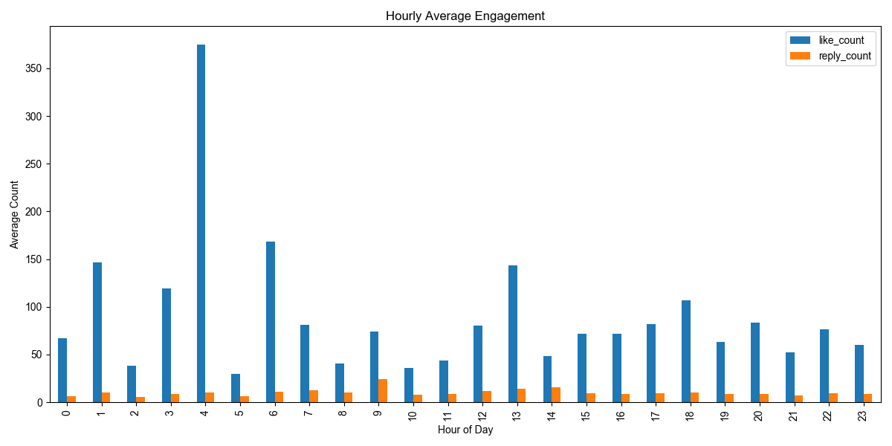
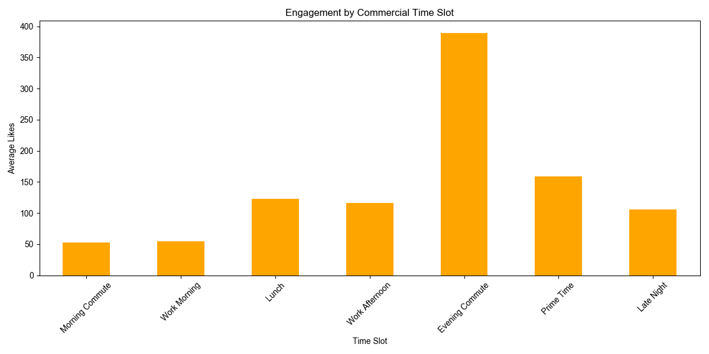
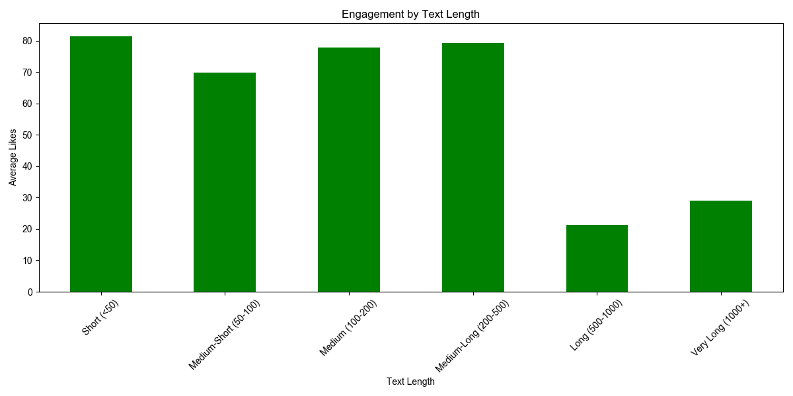
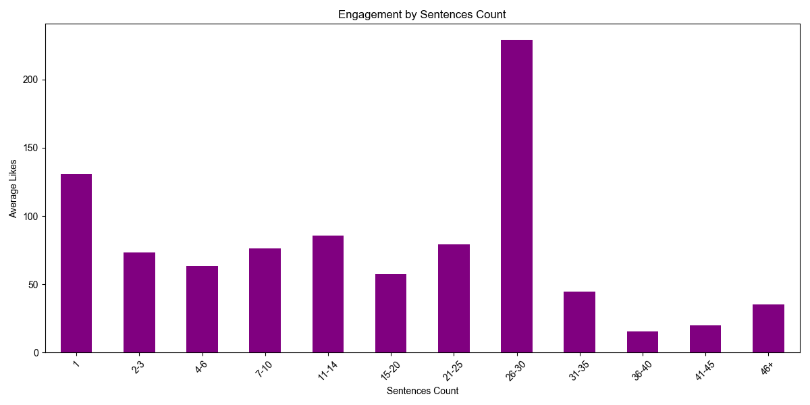

# 基礎指標分析

> 分析時間、內容形式與互動成效的關係

## 一、時間維度分析

### 1.1 每小時成效

**最佳發文時段（Top 5）：**

| 時段  | 平均按讚數 | 文章數 (分母) | 平均回覆數 | 平均轉發數 |
| ----- | ---------- | ------------- | ---------- | ---------- |
| 04:00 | 375.2      | 78            | 9.9        | 3.1        |
| 06:00 | 168.0      | 109           | 11.1       | 2.1        |
| 01:00 | 146.9      | 213           | 10.2       | 2.7        |
| 13:00 | 143.3      | 422           | 14.2       | 5.9        |
| 03:00 | 119.3      | 123           | 8.9        | 1.7        |



**關鍵發現：**

- 🎯 **最佳時段**：04:00 (凌晨4點) 互動最高，但樣本數較少 (78篇)
- 🌅 **午間時段**：13:00 (下午1點) 互動穩定且樣本充足 (422篇)
- 🌙 **深夜時段**：01:00-06:00 整體表現優異（可能是夜貓族或國際觀眾）
- ⚠️ **注意**：移除大帳號後，晚間時段 (18:00-20:00) 的優勢不再明顯

### 1.2 均等時段分析

將 24 小時分為 6 個 4 小時時段：

| 時段          | 時間範圍    | 平均按讚數 | 文章數 (分母) | 平均回覆數 | 平均轉發數 |
| ------------- | ----------- | ---------- | ------------- | ---------- | ---------- |
| Early Morning | 04:00-08:00 | 159.6      | 380           | 10.8       | 1.8        |
| Late Night    | 00:00-04:00 | 88.7       | 829           | 7.6        | 1.7        |
| Morning       | 08:00-12:00 | 46.9       | 1,544         | 12.2       | 6.2        |
| Afternoon     | 12:00-16:00 | 84.6       | 1,820         | 13.5       | 4.0        |
| Evening       | 16:00-20:00 | 81.1       | 1,929         | 12.0       | 4.7        |
| Night         | 20:00-24:00 | 68.7       | 2,271         | 10.4       | 3.3        |

**洞察：**

- 🌅 **Early Morning (04:00-08:00)** 是最佳時段，互動最高 (159.6)
- 🌙 **Late Night (00:00-04:00)** 表現穩定 (88.7)，樣本充足 (829篇)
- 📉 **Morning (08:00-12:00)** 互動最低 (46.9)，但回覆數較高 (12.2)
- 📊 **Night (20:00-24:00)** 雖然樣本最多 (2,271篇)，但互動偏低 (68.7)

### 1.3 商業時段分析

根據用戶行為習慣定義的商業時段：

| 時段類別        | 時間範圍    | 平均按讚數 | 文章數 (分母) | 排名 |
| --------------- | ----------- | ---------- | ------------- | ---- |
| Lunch           | 12:00-13:30 | 102.5      | 707           | 🥇   |
| Late Night      | 23:00-07:00 | 98.1       | 1,544         | 🥈   |
| Evening Commute | 18:00-19:30 | 90.5       | 724           | 🥉   |
| Work Afternoon  | 13:30-18:00 | 74.9       | 2,044         | 4    |
| Prime Time      | 19:30-23:00 | 70.8       | 2,066         | 5    |
| Morning Commute | 07:00-09:00 | 52.9       | 468           | 6    |
| Work Morning    | 09:00-12:00 | 48.6       | 1,220         | 7    |



**建議策略：**

- ✅ **優先**：午休時段 (12:00-13:30) - 互動最高 (102.5)，樣本充足 (707篇)
- ✅ **次選**：深夜時段 (23:00-07:00) - 穩定表現 (98.1)，樣本最多 (1,544篇)
- ✅ **第三**：晚間通勤 (18:00-19:30) - 表現良好 (90.5)
- ⚠️ **避免**：早上上班時段 (07:00-12:00) - 互動最低 (48.6-52.9)

---

## 二、內容形式分析

### 2.1 文章長度

| 長度區間                 | 平均按讚數 | 文章數 (分母) | 排名 |
| ------------------------ | ---------- | ------------- | ---- |
| Short (<50 字)           | 81.5       | 2,619         | 🥇   |
| Medium-Long (200-500 字) | 79.3       | 1,662         | 🥈   |
| Medium (100-200 字)      | 77.8       | 2,106         | 🥉   |
| Medium-Short (50-100 字) | 69.8       | 2,333         | 4    |
| Long (500-1000 字)       | 21.2       | 52            | 5    |
| Very Long (1000+ 字)     | 29.0       | 1             | 6    |



**甜蜜點：<50 字 或 100-500 字**

- ✅ **短篇 (<50字)**：互動最高 (81.5)，樣本最多 (2,619篇) - 適合金句、快速分享
- ✅ **中篇 (100-500字)**：互動穩定 (77.8-79.3)，樣本充足 - 適合完整表達想法
- ⚠️ **避免**：
  - 超過 500 字的長文（互動大幅下降至 21.2）
  - 50-100 字的尷尬長度（互動最低 69.8）

### 2.2 句子數量

| 句子數   | 平均按讚數 | 文章數 (分母) | 特徵            |
| -------- | ---------- | ------------- | --------------- |
| 26-30 句 | 229.3      | 95            | 🏆 完整教學文   |
| 1 句     | 130.8      | 605           | ✨ 金句型       |
| 11-14 句 | 85.8       | 1,247         | 📋 結構化內容   |
| 21-25 句 | 79.5       | 202           | 📝 中長篇內容   |
| 7-10 句  | 76.1       | 1,969         | 💡 中篇分享     |
| 15-20 句 | 57.7       | 605           | 📖 長篇內容     |
| 4-6 句   | 63.6       | 2,575         | 🔹 簡短分享     |
| 2-3 句   | 73.5       | 1,305         | ⚠️ 過短       |



**內容策略建議：**

1. **完整型** (26-30 句)

   - 適合：系統化教學、詳細攻略
   - 互動：229.3 讚 ⭐（最高）
   - 最佳長度：500-700 字
   - 注意：樣本較少 (95篇)，需確保內容品質
2. **金句型** (1 句)

   - 適合：勵志、名言、引發共鳴
   - 互動：130.8 讚
   - 最佳長度：<50 字
   - 時機：任何時段皆可
3. **結構化型** (11-14 句)

   - 適合：條列式分享、步驟教學
   - 互動：85.8 讚
   - 最佳長度：200-300 字
   - 樣本充足 (1,247篇)，穩定可靠
4. **中篇型** (7-10 句)

   - 適合：快速分享觀點、經驗
   - 互動：76.1 讚
   - 最佳長度：150-250 字
   - 樣本最多 (1,969篇)，最常見格式

⚠️ **避免：**

- 15-20 句的長篇內容（互動下降至 57.7 讚）
- 超過 30 句的過長內容（互動大幅下降至 15-44 讚）
- 2-3 句的尷尬長度（互動偏低 73.5 讚）

---

## 三、關鍵洞察

### 3.1 成功內容公式

**最佳組合 A：完整教學型**

```
發文時間：13:00 (午休時段) 或 04:00 (凌晨)
內容長度：200-500 字 (分母: 1662 篇)
句子數量：26-30 句 (分母: 95 篇)
預期按讚：200+
```

**最佳組合 B：金句型**

```
發文時間：13:00 (午休時段) 或 04:00 (凌晨)
內容長度：<50 字 (分母: 2619 篇)
句子數量：1 句 (分母: 605 篇)
預期按讚：130+
```

**最佳組合 C：結構化分享**

```
發文時間：12:00-13:30 (午休時段)
內容長度：100-200 字 (分母: 2106 篇)
句子數量：11-14 句 (分母: 1247 篇)
預期按讚：85+
```

### 3.2 時間 × 長度交叉策略

| 時段        | 推薦內容類型 | 推薦長度  | 推薦句數 |
| ----------- | ------------ | --------- | -------- |
| 12:00-13:30 | 完整教學/結構化 | 200-500字 | 26-30句  |
| 23:00-07:00 | 金句/短文    | <50字     | 1 句     |
| 13:30-18:00 | 中篇分享    | 100-200字 | 7-10句   |

### 3.3 避雷指南

❌ **效果最差的組合：**

```
時間：09:00-12:00 (工作時段)
長度：50-100 字 (分母: 2333 篇)
句子數：15-20 句 (分母: 605 篇)
預期按讚：<50
```

---

## 四、數據說明

### 4.1 資料概況

- **資料筆數**：8,773 篇貼文
- **創作者數**：95 位
- **時間範圍**：2024-2026
- **分析時區**：台灣時間 (UTC+8)
- **資料過濾**：已排除粉絲數 >100k 的大帳號，確保分析結果反映一般創作者的表現
- **粉絲數範圍**：15 - 23,451 粉（平均 4,447 粉，中位數 2,736 粉）

### 4.2 資料處理

- **異常值處理**：移除 1,586 筆時間戳記異常資料
- **大帳號過濾**：移除粉絲數 >100k 的帳號，避免單一大帳號影響整體分析
- **計算方式**：各群組平均值與樣本數
- **離群值**：保留原始資料（但已排除極端大帳號）

### 4.3 分析工具

- 語言：Python 3.11
- 套件：pandas, matplotlib
- 視覺化：matplotlib

---

## 附錄：分析程式碼

完整分析腳本：[scripts/basic_analysis.py](../scripts/basic_analysis.py)

### 核心程式碼片段

```python
# 時間分析
df['hour'] = df['posted_at_tw'].dt.hour
hourly_stats = df.groupby('hour')[
    ['like_count', 'reply_count', 'repost_count']
].mean()

# 內容形式分析
df['text_length'] = df['text'].astype(str).str.len()
df['sentences_count'] = df['text'].apply(count_sentences)

# 分組統計
length_stats = df.groupby('length_bin', observed=False)[
    ['like_count', 'reply_count', 'repost_count']
].mean()
```

### 執行分析

```bash
# 執行完整分析
python scripts/basic_analysis.py

# 輸出檔案
# - scripts/tables/basic-analysis.csv (原始資料)
# - scripts/plots/basic-analysis/*.png (視覺化圖表)
```

---

📊 **最後更新**：2026-01-21
