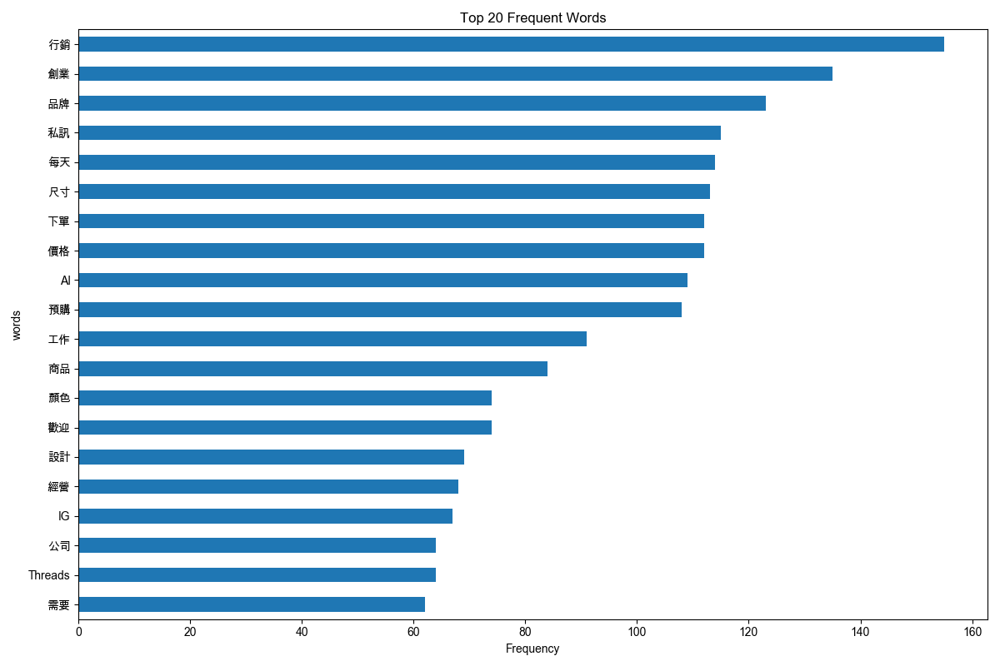
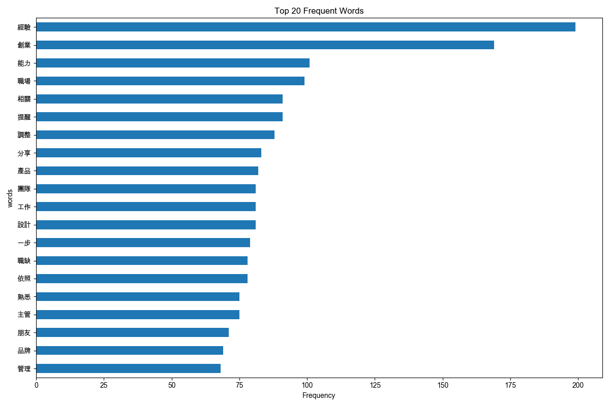

# 詞彙分析報告：Threads 貼文在不同粉絲級距的常用詞彙

> 透過高頻詞彙揭示不同粉絲級距帳號的「真實身份」——從電商賣家到職場專業人士。

---

## 一、關鍵發現

### Threads「創業帳號」的真相

我們分析了 8,677 篇貼文、95 位創作者的詞彙使用，發現一個有趣的現象：

**不同粉絲級距的帳號，本質上是完全不同的群體。**

| 級距        | 高頻詞特徵                    | 真實身份                                         |
| ----------- | ----------------------------- | ------------------------------------------------ |
| 0-100 粉    | IG, shopee, 蝦皮, 技巧        | **導流者**：還在學習，想把流量導到其他平台 |
| 100-1k 粉   | 行銷, 品牌 + 尺寸, 預購, 下單 | **電商賣家**：這不是「創作者」，是在賣東西 |
| 1k-10k 粉   | 創業, 廣告, 朋友, 生活, 人生  | **內容創作者**：真正在做個人品牌           |
| 10k-100k 粉 | 經驗, 職場, 能力, 職缺, 團隊  | **職場專業人士**：在招募、建立專業影響力   |

---

## 二、各級距詞彙分析

### 2.1 級距：0-100 粉（導流者）

**樣本**：12 帳號，210 篇文章

**Top 10 高頻詞：**

| 詞彙   | 出現次數 | 創作者數 | 解讀             |
| ------ | -------- | -------- | ---------------- |
| IG     | 44       | 6        | 導流到 Instagram |
| 分享   | 42       | 6        | 基礎互動詞       |
| shopee | 41       | 1        | 導流到蝦皮       |
| 工作   | 31       | 4        | 職場相關         |
| 技巧   | 28       | 2        | 學習型內容       |
| AI     | 27       | 4        | 工具話題         |
| 情緒   | 27       | 2        | 心情抒發         |
| 設計   | 26       | 3        | 技能分享         |
| 數位   | 24       | 3        | 數位工具         |
| 蝦皮   | 22       | 2        | 電商導流         |


**數據洞察：**

這個級距的帳號**不是在經營 Threads，而是在「導流」**。高頻詞中 `IG`、`shopee`、`蝦皮` 佔據前列，顯示他們把 Threads 當作流量跳板，而非內容主場。

---

### 2.2 級距：100-1k 粉（電商賣家混合體）

**樣本**：22 活躍帳號，1,100 篇文章（經抽樣）

**Top 10 高頻詞：**

| 詞彙 | 出現次數 | 創作者數 | 解讀               |
| ---- | -------- | -------- | ------------------ |
| 行銷 | 155      | 7        | 行銷話題           |
| 創業 | 135      | 19       | 創業主題           |
| 品牌 | 123      | 10       | 品牌經營           |
| 私訊 | 115      | 14       | **電商用語** |
| 每天 | 114      | 17       | 日常發文           |
| 尺寸 | 113      | 3        | **電商用語** |
| 下單 | 112      | 6        | **電商用語** |
| 價格 | 112      | 12       | **電商用語** |
| 預購 | 108      | 4        | **電商用語** |
| AI   | 109      | 9        | 工具話題           |



**數據洞察：**

**這個級距充斥著電商賣家。**

Top 10 高頻詞中，`私訊`、`尺寸`、`下單`、`價格`、`預購` 都是典型的電商用語。這表示 100-1k 粉絲級距的「創業帳號」，有相當比例其實是**在 Threads 上賣東西的電商**，而非純粹的「內容創作者」。

如果你是想學習「內容經營」的創作者，**這個級距的數據參考價值有限**。

---

### 2.3 級距：1k-10k 粉（真正的創作者）

**樣本**：31 活躍帳號，1,550 篇文章（經抽樣）

**Top 10 高頻詞：**

| 詞彙 | 出現次數 | 創作者數 | 解讀         |
| ---- | -------- | -------- | ------------ |
| 創業 | 356      | 24       | 核心主題     |
| 廣告 | 204      | 10       | 廣告投放話題 |
| 喜歡 | 181      | 23       | 情感連結     |
| AI   | 152      | 13       | 工具話題     |
| 朋友 | 150      | 24       | 社群連結     |
| 分享 | 141      | 25       | 內容分享     |
| 商品 | 138      | 11       | 產品相關     |
| 工作 | 135      | 22       | 職場話題     |
| 努力 | 130      | 25       | 勵志內容     |
| 生活 | 127      | 21       | 生活分享     |


**數據洞察：**

**這才是真正的「創作者聚集地」。**

與 100-1k 級距相比，這裡的高頻詞從「尺寸、預購、下單」變成了「創業、廣告、喜歡、朋友、生活」。這是內容創作的核心詞彙：

- **創業** (356次)：分享創業故事與經驗
- **喜歡、朋友** (150-180次)：建立情感連結
- **生活、努力** (127-130次)：展現真實自我

如果你想學習「如何經營個人品牌」，**這個級距的內容最有參考價值**。

---

### 2.4 級距：10k-100k 粉（職場專業人士）

**樣本**：6 活躍帳號，600 篇文章（經抽樣）

**Top 10 高頻詞：**

| 詞彙 | 出現次數 | 創作者數 | 解讀               |
| ---- | -------- | -------- | ------------------ |
| 經驗 | 199      | 3        | 經驗分享           |
| 創業 | 169      | 3        | 創業話題           |
| 能力 | 101      | 4        | 能力培養           |
| 職場 | 99       | 4        | **職場話題** |
| 提醒 | 91       | 5        | 建議提醒           |
| 相關 | 91       | 4        | 關聯說明           |
| 團隊 | 81       | 3        | **團隊管理** |
| 職缺 | 78       | 1        | **招募徵才** |
| 產品 | 82       | 5        | 產品話題           |
| 設計 | 81       | 3        | 設計相關           |



**數據洞察：**

**這個級距的帳號在「招募」。**

高頻詞中出現 `職場`、`團隊`、`職缺`，這不是一般的內容分享，而是**職場專業人士在做兩件事**：

1. **分享職場經驗**：經驗、能力、職場
2. **招募團隊成員**：團隊、職缺

這解釋了為什麼 10k+ 粉絲的帳號內容風格與小帳號截然不同——他們的目標受眾和內容策略完全不同。

---

## 三、類別成效分析

我們將詞彙分為七大類別，分析各類別的互動表現：

| 類別                      | 平均按讚 | 平均回覆 | 解讀                         |
| ------------------------- | -------- | -------- | ---------------------------- |
| **Career (職涯)**   | 59.7     | 6.7      | 全場最高，職場話題是流量密碼 |
| **Business (商業)** | 49.8     | 10.9     | 商業話題有高回覆率           |
| **Media (自媒體)**  | 40.1     | 17.6     | 自媒體話題引發最多討論       |
| **Life (生活)**     | 39.9     | 10.0     | 生活分享有穩定互動           |
| **Growth (成長)**   | 32.3     | 4.7      | 成長話題表現中等             |
| **Money (金錢)**    | 25.4     | 6.6      | 直接談錢效果較差             |
| **Tech (科技)**     | 20.6     | 3.8      | 純技術話題互動最低           |

**結論**：**Career (職涯) 是全場冠軍**。談論工作、職場、離職，永遠有流量。

---

## 四、給不同階段創作者的建議

### 4.1 給新手 (0-1k 粉)

**問題**：這個級距混雜著電商賣家，數據參考價值有限。

**建議**：

- 不要只是導流，要**產出有價值的內容**
- 參考 1k-10k 級距的內容策略
- 關鍵字：`職場`、`人生`、`故事`、`經驗`

### 4.2 給成長期創作者 (1k-10k 粉)

**優勢**：你們是真正的創作者聚集地。

**建議**：

- 持續產出 `創業`、`生活`、`朋友` 相關內容
- AI 話題正夯 (152 次出現)，可以多分享 AI 應用經驗
- 建立情感連結比教學更重要

### 4.3 給專業人士 (10k+ 粉)

**現況**：你們在分享經驗的同時也在招募。

**建議**：

- 繼續分享 `職場`、`經驗`、`能力` 相關內容
- 如果有招募需求，Threads 是好管道
- 展現「人味」比純專業內容更圈粉

---

## 五、數據說明

### 5.1 資料處理

- **原始資料**：8,773 篇貼文
- **分析資料**：8,677 篇（移除 >1000 讚的極端爆文）
- **創作者數**：95 位
- **資料清理**：移除「已靜音」及 Instagram 元數據
- **抽樣**：100-1k、1k-10k、10k-100k 級距採用「每人最近 50-100 篇」抽樣

### 5.2 停用詞處理

已過濾以下噪音詞彙：

- 數字類：日期、時間、價格數字
- 填充詞：一樣、還有、只要、然後等
- 標點符號：..、--等
- URL 相關：tw、http 等

---

## 附錄

完整分析腳本：[scripts/word/analysis.py](../scripts/word/analysis.py)

```bash
# 執行分析
uv run python scripts/word/analysis.py

# 輸出檔案
# - scripts/outputs/tables/word-analysis-{tier}.csv
# - scripts/outputs/plots/word-analysis/{tier}/top_words_freq.png
# - scripts/outputs/plots/word-analysis/{tier}/wordcloud.png
```

---

📊 **最後更新**：2026-02-04
