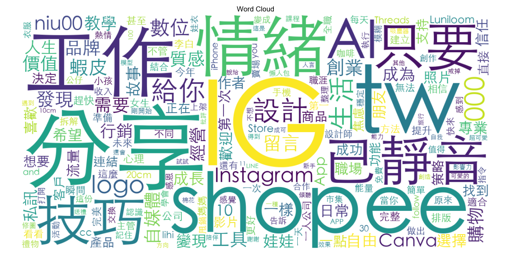
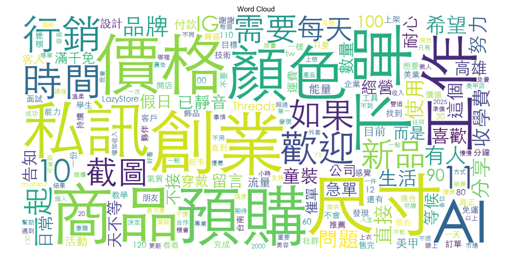
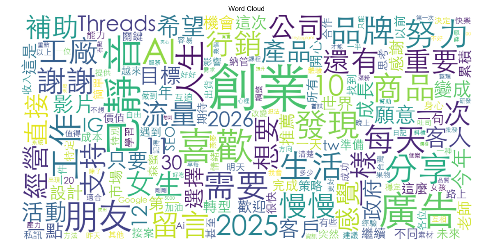
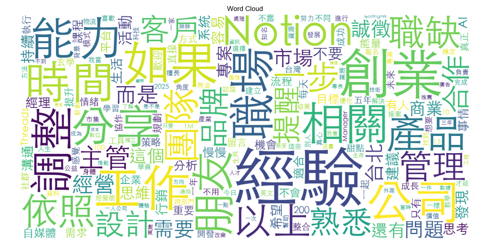
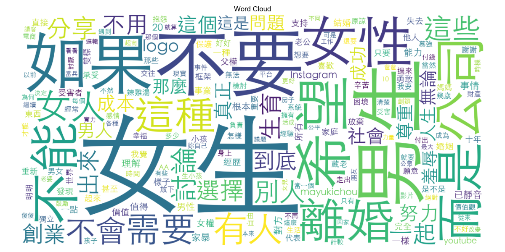

# 詞彙分析報告：不同粉絲級距的創新創業觀察

> 本報告針對不同粉絲規模（Tier）的帳號進行深入分析，探討在「創新創業」相關話題中，不同量體的帳號關注的關鍵字、互動模式以及內容策略差異。
>
> **更新說明 (2026-01-21)**：
> 1. **數據清理**：移除所有文章中的"已靜音"及其後的 Instagram 元數據（logo、用戶名等），確保分析的文本純度。清理了 557 篇文章（約 5.2%）。
> 2. **抽樣優化**：針對 100-1k、1k-10k 與 10k-100k 級距，採用「每人取最近 50-100 篇文章」並過濾掉發文數過少的用戶，以聚焦於活躍創作者，消除高頻發文者（如賣家、機器人）與低頻使用者造成的數據偏差。
> 3. **停用詞優化**：新增 56 個停用詞（包含"已靜音"），涵蓋連接詞（而是、如果、或是）、指示詞（這個、那個、這些）、程度詞（完全、常常、真正）、否定詞（不要、不能、不會）、代詞（有人、別人）、動詞（出來、進來、起來）、通用名詞（東西、事情、時間）及特定詞彙（Ctrl、不再、我當、...），使分析結果更聚焦於實質關鍵字。

## 一、 粉絲級距概況 (Overview)

我們將資料中的帳號依據粉絲數分為五個級距。以下是各級距的基本數據概況：

| 粉絲級距 (Tier)    | 帳號數 | 文章數 | 總互動數 | 每篇平均互動 | 平均互動率 | 平均粉絲數 |
| :----------------- | -----: | -----: | -------: | -----------: | ---------: | ---------: |
| **0-100**    |     12 |    210 |    5,350 |         25.5 |     40.11% |       44.7 |
| **100-1k**   |     40 |  2,639 |  207,219 |         78.5 |     15.33% |      431.6 |
| **1k-10k**   |     36 |  4,824 |  418,416 |         86.7 |      2.35% |    4,146.0 |
| **10k-100k** |      7 |  1,100 |  130,660 |        118.8 |      0.69% |   16,237.6 |
| **100k-1m**  |      1 |    298 |  588,972 |      1,976.4 |      0.94% |  210,890.0 |

**觀察重點：**

1. **微型帳號的高互動率**：0-100 粉與 100-1k 粉的帳號擁有極高的平均互動率（分別為 40% 與 15%），顯示初期社群黏著度極高，或內容多為親友互動。
2. **中型帳號的內容主力**：1k-10k 級距貢獻了最多的文章數量 (4,824 篇)，是此話題最活躍的群體。
3. **大型帳號的流量效應**：100k-1m 雖然僅有 1 個帳號 (mayukichou)，但每篇文章平均互動量高達 1,976.4（遠超其他級距），總互動數 58 萬+，顯示頭部網紅在話題上的絕對宰制力。
4. **互動量隨粉絲數增長**：每篇平均互動量從 25.5（0-100粉）成長至 1,976.4（100k-1m粉），但互動率卻遞減，符合大帳號「絕對值高、相對值低」的規律。

---

## 二、 各級距詞彙分析 (Word Analysis by Tier)

### 2.1 級距：0-100 粉 (起步期)

*   **樣本資訊**：12 個帳號，共 210 篇文章（全數分析，未抽樣）。
*   **特徵**：剛開始經營，內容較雜，包含心情抒發、工具分享與初步導流嘗試。
*   **Top 5 高頻詞**：`IG` (44), `分享` (43), `tw` (42), `shopee` (41), `工作` (35)
*   **Top 5 高互動詞** (中位數按讚)：
    1.  `人生` (17)
    2.  `職場` (11)
    3.  `找到` (6)
    4.  `故事` (4)
    5.  `朋友` (4)
*   **觀察**：此階段帳號常使用外部連結詞彙（IG, Shopee, tw），顯示正在嘗試將 Threads 流量導引至其他平台。高互動話題聚焦於「人生感悟」、「職場心得」與「尋找方向」等生活探索主題，情感共鳴是此階段的互動驅動力。



### 2.2 級距：100-1k 粉 (成長/變現期) - *經抽樣修正*

*   **抽樣資訊**：從 40 個帳號中篩選出 22 個活躍創作者（發文 > 50 篇），共抽樣 1,100 篇文章進行分析。
*   **特徵**：經過篩選活躍用戶（>50篇）與抽樣後，此級距展現出強烈的「行銷」與「變現」企圖心，同時包含部分電商賣家。
*   **Top 5 高頻詞**：`行銷` (155), `創業` (136), `品牌` (123), `私訊` (113), `尺寸` (113)
*   **Top 5 高互動詞** (中位數按讚)：
    1.  `大樓` (81.5)
    2.  `互相` (52)
    3.  `網站` (41.5)
    4.  `案子` (38)
    5.  `修護` (36)
*   **觀察**：此級距創作者非常積極於「行銷」、「品牌」與「接案」。高互動詞如 `網站`、`案子` 暗示「工具教學」或「接案經驗」類型的內容在此階段非常受歡迎。`互相`、`大樓` 的高互動反映了微型創作者之間「互助/互粉/蓋樓」的社群文化。同時，`尺寸`、`私訊`、`預購` 等電商詞彙顯示部分活躍用戶是在 Threads 上進行商品銷售。



### 2.3 級距：1k-10k 粉 (穩定期/個人品牌) - *經抽樣修正*

*   **抽樣資訊**：從 36 個帳號中篩選出 31 個活躍創作者（發文 > 50 篇），共抽樣 1,550 篇文章進行分析。
*   **特徵**：篩選活躍用戶後，話題更聚焦於「創業實戰」與「品牌經營」，互動感強烈。
*   **Top 5 高頻詞**：`創業` (353), `廣告` (204), `喜歡` (176), `AI` (152) / `朋友` (152), `分享` (143)
*   **Top 5 高互動詞** (中位數按讚)：
    1.  `momo` (258)
    2.  `構圖` (212)
    3.  `基礎` (206)
    4.  `2024` (204)
    5.  `拍照` (180)
*   **觀察**：此級距是「創業故事」與「實戰技巧」的主要產地。高互動詞彙如 `構圖`、`拍照`、`排版`、`質感` 顯示「視覺呈現」與「內容製作教學」是此階段讀者的核心剛需。`momo`、`廣告` 的出現代表此階段創作者已開始接觸更複雜的電商平台與廣告投放議題。值得注意的是，`AI` (152次) 與 `朋友` (152次) 並列第5高頻，顯示此階段創作者在關注新興工具的同時，仍重視「人際連結」與「社群經營」。`2024` 的高互動暗示「年度回顧」或「趨勢預測」類型的內容特別受歡迎。



### 2.4 級距：10k-100k 粉 (專業影響力) - *經抽樣修正*

*   **抽樣資訊**：從 7 個帳號中篩選出 6 個活躍創作者（發文 > 100 篇），共抽樣 600 篇文章進行分析。
*   **特徵**：知識型網紅、專業工作者聚集地，強調職場能力、團隊管理與自媒體經營。
*   **Top 5 高頻詞**：`經驗` (199), `創業` (169), `能力` (102), `職場` (99), `相關` (91) / `提醒` (91)
*   **Top 5 高互動詞** (中位數按讚)：
    1.  `人粉` (219.5)
    2.  `獵頭` (202)
    3.  `發文` (174.5)
    4.  `經營脆` (151.5)
    5.  `不露` (147)
*   **觀察**：內容高度聚焦於「職場生存」、「專業技能」與「平台經營心法」。高互動詞如 `經營脆` (Threads)、`人粉`、`發文`、`萬粉` 顯示，當粉絲數達到此量級，讀者非常渴望了解「如何經營自媒體」以及「如何突破萬粉門檻」。`獵頭` (202) 的高互動反映此階段讀者對「職涯發展」與「獵頭合作」的關注。`不露` (不露臉經營) 的高互動也反映了部分創作者對「匿名經營」策略的好奇與需求。此外，高頻詞中出現大量職缺相關詞彙（職缺、誠徵、熟悉、台北），顯示此級距創作者也積極於「團隊招募」。



### 2.5 級距：100k-1m 粉 (頭部網紅/社會議題)

*   **樣本資訊**：1 個帳號 (mayukichou)，共 298 篇文章（全數分析，未抽樣）。
*   **特徵**：話題高度集中在性別議題、兩性關係與社會觀點，具有極強的傳播力與社會影響力。
*   **Top 5 高頻詞**：`女生` (169), `男生` (62), `希望` (34), `女性` (31), `公司` (29)
*   **Top 5 高互動詞** (中位數按讚)：
    1.  `對方` (13,000)
    2.  `失去` (7,118)
    3.  `公司` (7,118)
    4.  `老公` (2,425)
    5.  `羞辱` (2,219)
*   **觀察**：此級距的互動量級與其他層級完全不同（中位數按讚破萬，最高達 1.3 萬）。關鍵字 `離婚`、`父權`、`女權`、`羞辱`、`男女`、`老公` 顯示大帳號傾向討論具爭議性、能引發廣泛共鳴的社會或兩性議題，而非單純的創業或商業教學。`對方`、`失去`、`保護` 等情感詞彙的超高互動，反映了讀者對「關係處理」、「情感困境」與「自我保護」等議題的強烈共鳴。值得注意的是，雖然關鍵字多為兩性議題，但 `公司` (7,118) 的高互動顯示，當性別議題與職場脈絡結合時（如職場性別歧視、女性職涯困境），更能引發病毒式傳播。



---

## 三、 類別成效分析 (Category Performance)

我們將詞彙分為七大類：Business, Career, Growth, Life, Media, Money, Tech。以下分析各級距在不同類別的表現：

### 3.1 各級距最佳互動類別 (Average Likes)

* **0-100 粉**：**Career (201.7)** - 職場話題最能引發共鳴。
* **100-1k 粉 (抽樣後)**：**Career (56.6)** - 職場話題仍是主流，其次是 Life 與 Growth。
* **1k-10k 粉 (抽樣後)**：**Career (147.5)** & **Business (81.1)** - 職涯與商業話題並重，顯示此階段讀者對於「如何透過專業變現」最感興趣。
* **10k-100k 粉 (抽樣後)**：**Life (244.0)** - 生活感悟類內容大幅反超專業內容，顯示讀者更渴望看到專業人士的「真實生活」或「心態分享」。
* **100k-1m 粉**：**Career (7015.5)** & **Business (4092.1)** - 雖然關鍵字多為兩性，但歸類在 Career/Business 下的詞彙（如公司、工作）在特定脈絡下創造了驚人的互動。

### 3.2 觀察總結

1. **Career (職涯)** 是全級距的「硬通貨」，無論粉絲多寡，談論工作、職場、離職永遠有流量。
2. **Life (生活)** 在 10k-100k 級距的異軍突起（平均按讚 244）非常值得注意，這代表當專業度達到一定門檻後，展現「人味」與「生活風格」是進一步圈粉的關鍵。
3. **Media (自媒體)** 在 10k-100k 級距也有不錯的表現 (77.7)，顯示中大型創作者分享「經營心法」是有市場的。

---

## 四、 結論與建議

### 4.1 給新手的建議 (0-1k 粉)

*   **策略**：多談論「職場心得」、「人生選擇」與「尋找方向」的故事，並嘗試分享實用的「工具」或「資源」。
*   **關鍵字**：職場、人生、找到、故事、朋友、信任。
*   **機會**：製作簡單易懂的「工具整理」或「資源懶人包」容易獲得轉發與收藏。分享「第一次」嘗試某件事的心路歷程，更能引發共鳴。

### 4.2 給成長期創作者的建議 (1k-10k 粉)

*   **策略**：分享具體的「創業實戰」、「視覺呈現技巧」與「行銷經驗」，並關注 AI 等新興工具的應用。
*   **關鍵字**：構圖、拍照、排版、質感、momo、廣告、AI、基礎。
*   **機會**：撰寫關於「如何拍出好照片」、「如何做行銷素材」、「如何用 AI 提升效率」的教學文，能精準打中此階段讀者的痛點。「基礎教學」類型的內容（如構圖基礎、排版基礎）特別受歡迎。

### 4.3 給專業人士的建議 (10k-100k 粉)

*   **策略**：在專業內容中融入「生活感」與「個人觀點」，並適度分享「經營 Threads/自媒體」的心得與「突破萬粉」的經驗。
*   **關鍵字**：經營脆、人粉、萬粉、發文、獵頭、不露（不露臉經營）。
*   **轉型**：從單純的知識輸出，轉向展現個人魅力與生活哲學，讓讀者喜歡「你這個人」而不只是你的知識。分享「如何不露臉也能經營自媒體」的策略也能吸引大量關注。

### 4.4 流量密碼 (通用)

*   **爭議性話題**：性別（女生/男生/女權/父權）、兩性（離婚/老公/對方）、薪資、離職、職場歧視。
*   **情緒價值**：失去、羞辱、保護、希望、努力、故事、找到。
*   **實用價值**：AI、拍照技巧（構圖/排版/質感）、經營心法（經營脆/人粉/發文）、基礎教學。
*   **社群文化**：互相、大樓、加油（微型創作者互助文化）。
*   **年度回顧**：2024、2025（年度總結類型內容特別受歡迎）。

---

## 附錄：分析程式碼

完整分析腳本：[scripts/word_analysis.py](../scripts/word_analysis.py)

### 核心程式碼片段

```python
# 1. 設定 jieba 與停用詞
stop_words = setup_jieba()

# 2. 載入資料
df = load_data(data_dir)

# 3. 依粉絲數分級距
df["tier"] = df["followers"].apply(get_follower_tier)

# 4. 斷詞分析
df["words"] = df["text"].apply(lambda x: segment_text(x, stop_words))
word_df = df.explode("words").dropna(subset=["words"])

# 5. 詞頻統計
word_counts = word_df["words"].value_counts()

# 6. 互動分析（使用中位數避免離群值）
word_stats = word_df.groupby("words")[
    ["like_count", "reply_count", "repost_count"]
].agg(["count", "median", "mean"])

# 7. 類別分析
word_df["category"] = word_df["words"].map(word_to_cat)
cat_stats = word_df.groupby("category")[
    ["like_count", "reply_count", "repost_count"]
].mean()
```

### 執行分析

```bash
# 執行完整分析（會依粉絲級距分別分析）
python scripts/word_analysis.py

# 輸出檔案
# - scripts/tables/word-analysis-{tier}.csv (各級距詞彙統計)
# - scripts/plots/word-analysis/{tier}/wordcloud.png (詞雲圖)
# - scripts/plots/word-analysis/{tier}/top_words_freq.png (高頻詞圖表)
# - scripts/plots/word-analysis/{tier}/top_words_engagement.png (高互動詞圖表)
# - scripts/plots/word-analysis/{tier}/category_performance.png (類別成效圖表)
```

### 所需套件

```bash
pip install jieba
pip install wordcloud
pip install pandas matplotlib
```

---

📊 **狀態**：✅ 已完成
**最後更新**：2026-01-21
