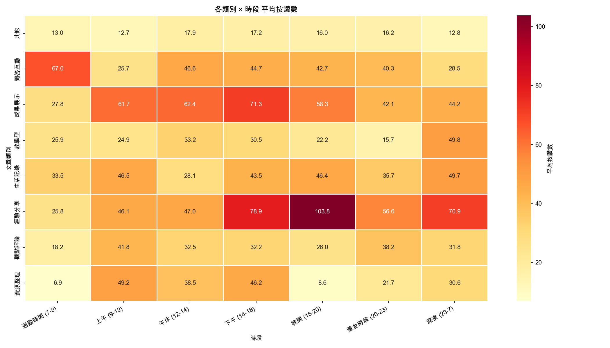
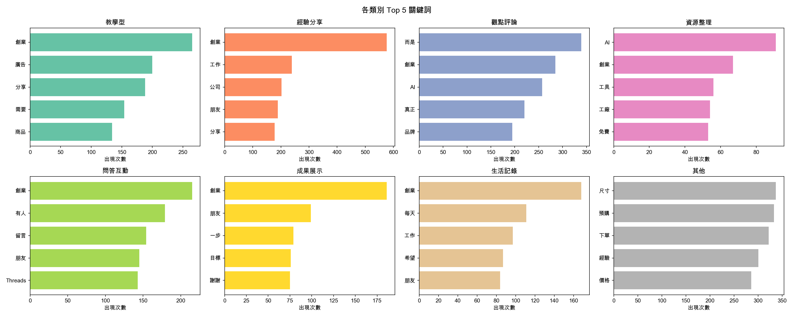

# 文章分類分析：什麼類型的貼文最有效？

> 用 AI 自動分類 8,655 篇貼文，找出最值得你投入的內容類型。

---

## 一、關鍵發現

### 如果你只看一個結論

我們使用 Google Gemini AI 對所有貼文進行自動分類，得出一個對創業帳號最重要的結論：

**不同類型的貼文，互動差距可達 4-12 倍。選對類型，比寫得更努力更重要。**

| 指標       | 最強類別   | 數值  | 最弱類別 | 數值  | 差距        |
| ---------- | ---------- | ----- | -------- | ----- | ----------- |
| 平均按讚數 | 經驗分享   | 67.1  | 其他     | 15.4  | **4.4 倍**  |
| 平均回覆數 | 問答互動   | 26.3  | 其他     | 2.2   | **12.0 倍** |
| 平均轉發數 | 資源整理   | 1.8   | 生活記錄 | 0.5   | **3.6 倍**  |

**一句話總結：想要讚就說故事（經驗分享），想要留言就問問題（問答互動），想要被分享就整理資源（資源整理）。**

---

## 二、分類方法論

### 2.1 AI 模型設定

| 項目       | 設定                    |
| ---------- | ----------------------- |
| AI 模型    | Google Gemini 2.0 Flash |
| 分類數量   | 8 大類                  |
| 信心閾值   | ≥ 0.75                 |
| 批次大小   | 每次 5 篇               |
| 低信心處理 | 自動歸類為「其他」      |
| 總文章數   | 8,655 篇               |

### 2.2 分類類別定義

| 類別         | 定義           | 特徵             | 範例             |
| ------------ | -------------- | ---------------- | ---------------- |
| **教學型**   | 步驟化教學內容 | 有明確步驟、方法 | 「3步驟學會XX」  |
| **經驗分享** | 個人經歷故事   | 有具體案例、數據 | 「我如何從0到1」 |
| **觀點評論** | 思考與評論     | 有觀點、分析     | 「關於XX的思考」 |
| **資源整理** | 工具清單推薦   | 有列表、連結     | 「10個好用工具」 |
| **問答互動** | 提問討論型     | 有問題、徵求意見 | 「大家怎麼看？」 |
| **成果展示** | 里程碑展示     | 有數據、成就     | 「突破10萬粉」   |
| **生活記錄** | 日常心情       | 隨筆、心情       | 「今天的感悟」   |
| **其他**     | 無法明確分類   | -                | -                |

---

## 三、分類結果

### 3.1 文章分布

| 類別     | 文章數 | 佔比   | 平均按讚 | 平均回覆 | 平均轉發 | 創作者數 |
| -------- | ------ | ------ | -------- | -------- | -------- | -------- |
| 其他     | 1,738  | 20.1%  | 15.4     | 2.2      | 0.6      | 89       |
| 觀點評論 | 1,629  | 18.8%  | 33.3     | 3.8      | 0.8      | 79       |
| 生活記錄 | 1,345  | 15.5%  | 41.4     | 6.1      | 0.5      | 88       |
| 問答互動 | 1,195  | 13.8%  | 39.3     | 26.3     | 0.8      | 81       |
| 經驗分享 | 1,061  | 12.3%  | 67.1     | 10.9     | 0.8      | 84       |
| 教學型   | 813    | 9.4%   | 28.5     | 3.0      | 1.4      | 63       |
| 成果展示 | 578    | 6.7%   | 55.0     | 13.4     | 0.9      | 75       |
| 資源整理 | 296    | 3.4%   | 29.8     | 4.3      | 1.8      | 60       |


**數據洞察：**

- **「其他」佔最多（20.1%）但表現最差**：這些是AI無法明確歸類的貼文——通常是純商品文、圖片描述、或過短的碎碎念。如果你的內容常被歸為「其他」，代表定位不夠明確。
- **「觀點評論」是最多人寫的明確類型（18.8%）**：說明 Threads 上的創業者最自然的反應是「發表看法」。但注意：觀點評論的按讚數只排第 5（33.3），發太多觀點文不一定有效。
- **「經驗分享」只佔 12.3% 但按讚最高（67.1）**：這是最大的機會——寫的人不多，但效果最好。

---

### 3.2 各類別成效排名

**按讚數排名（哪種類型最吸引人？）：**

| 排名 | 類別     | 平均按讚 | 中位數按讚 | 解讀                                   |
| ---- | -------- | -------- | ---------- | -------------------------------------- |
| 1    | 經驗分享 | 67.1     | 18.0       | 真實故事最能引起共鳴，中位數 18 代表多數也不差 |
| 2    | 成果展示 | 55.0     | 17.5       | 里程碑和成績單天生吸讚                  |
| 3    | 生活記錄 | 41.4     | 11.0       | 「人味」有流量，但中位數落差大           |
| 4    | 問答互動 | 39.3     | 9.0        | 提問引發參與，但讚數靠運氣               |
| 5    | 觀點評論 | 33.3     | 7.0        | 大量觀點文稀釋了品質，中位數僅 7         |

**回覆數排名（哪種類型最引發討論？）：**

| 排名 | 類別     | 平均回覆 | 中位數回覆 | 解讀                                       |
| ---- | -------- | -------- | ---------- | ------------------------------------------ |
| 1    | 問答互動 | 26.3     | 4.0        | 毫無懸念的冠軍，問問題就是要讓人回答        |
| 2    | 成果展示 | 13.4     | 2.0        | 人們喜歡恭喜和追問「怎麼做到的」           |
| 3    | 經驗分享 | 10.9     | 2.0        | 好故事讓人想回應自己的經歷                  |

**轉發數排名（哪種類型最值得分享？）：**

| 排名 | 類別     | 平均轉發 | 解讀                                       |
| ---- | -------- | -------- | ------------------------------------------ |
| 1    | 資源整理 | 1.8      | 工具清單最值得收藏分享，轉發率最高           |
| 2    | 教學型   | 1.4      | 步驟教學有實用價值，人們願意轉給朋友         |
| 3    | 成果展示 | 0.9      | 成功案例值得轉發學習                        |


**核心洞察：每種互動指標的冠軍都不同。** 這代表你需要根據目標選擇內容類型：
- 要**曝光**（按讚）→ 經驗分享
- 要**互動**（回覆）→ 問答互動
- 要**擴散**（轉發）→ 資源整理

---

## 四、深度分析

### 4.1 時間 × 類別：什麼時候發什麼？

每種類型的貼文都有最佳發佈時段。以下是各類別在不同時段的平均按讚數：

| 類別     | 最佳時段              | 平均讚 | 次佳時段            | 平均讚 |
| -------- | --------------------- | ------ | ------------------- | ------ |
| 經驗分享 | 晚間 18-20            | 103.8  | 下午 14-18          | 78.9   |
| 成果展示 | 下午 14-18            | 71.3   | 午休 12-14          | 62.4   |
| 問答互動 | 通勤 7-9              | 67.0   | 午休 12-14          | 46.6   |
| 教學型   | 深夜 23-7             | 49.8   | 午休 12-14          | 33.2   |
| 觀點評論 | 上午 9-12             | 46.5   | 晚間 18-20          | 46.4   |
| 生活記錄 | 深夜 23-7             | 49.7   | 上午 9-12           | 46.5   |
| 資源整理 | 上午 9-12             | 49.2   | 下午 14-18          | 46.2   |



**給創業帳號的時段建議：**

- **晚間 18-20**：這是「經驗分享」的黃金時段（103.8 讚！），下班後人們最願意沉浸在別人的故事裡。把你最好的故事留到這個時段發。
- **通勤 7-9**：「問答互動」的絕佳時機（67.0 讚），通勤族看到問題會順手回答。早上丟一個問題，一整天收留言。
- **下午 14-18**：「成果展示」在這個時段表現最佳（71.3 讚），午後分享好消息感染力最強。
- **上午 9-12**：「資源整理」和「觀點評論」的好時段，上班族在工作前會瀏覽實用資訊。
- **深夜 23-7**：「教學型」和「生活記錄」意外地在深夜表現好（49.8 讚），夜貓子喜歡學習和讀日記。

---

### 4.2 長度 × 類別：寫多長最有效？

不同類型的內容有不同的最佳長度：

| 類別     | 最佳字數區間 | 最佳區間平均讚 | 建議                                 |
| -------- | ------------ | -------------- | ------------------------------------ |
| 經驗分享 | 200-300 字   | 83.5           | 中等長度，一個完整故事剛好             |
| 成果展示 | 300-500 字   | 83.0           | 需要篇幅展示數據和過程                |
| 生活記錄 | 200-300 字   | 86.5           | 不要寫太長，200-300 字最有共鳴         |
| 問答互動 | 100-200 字   | 52.3           | 問題精煉，加上背景說明即可             |
| 教學型   | 500-1000 字  | 48.2           | 需要足夠篇幅說清楚步驟                |
| 觀點評論 | 100-200 字   | 71.6           | 精煉的觀點比冗長的論述更有力           |
| 資源整理 | 100-200 字   | 38.1           | 清單格式，每項簡短說明即可             |


**重點提醒：**

- **經驗分享 200-300 字是甜蜜點（83.5 讚）**——太短說不完故事，太長沒人看完。一個完整的小故事大約就是 200-300 字。
- **教學型需要最長篇幅（500-1000 字最佳，48.2 讚）**——但注意：教學型整體按讚數不高，用較長篇幅可以提升品質。
- **觀點評論短就好（100-200 字，71.6 讚）**——精煉的觀點比冗長分析更受歡迎。一個犀利的觀點 + 一個例子 = 100-200 字。
- **成果展示需要細節（300-500 字，83.0 讚）**——讀者想看具體數字、過程、和你學到了什麼。

---

### 4.3 關鍵詞 × 類別：各類型用什麼詞？

每種類型都有其獨特的關鍵詞特徵，這能幫助你快速對標自己的內容：

| 類別     | Top 5 關鍵詞                     | 詞彙特徵                   |
| -------- | -------------------------------- | -------------------------- |
| 教學型   | 創業、廣告、分享、需要、商品     | 實務操作詞彙，聚焦「怎麼做」 |
| 經驗分享 | 創業、工作、公司、朋友、分享     | 人際和職場敘事，聚焦「我的故事」 |
| 觀點評論 | 市場、創業、AI、真正、品牌       | 產業分析詞彙，聚焦「我怎麼看」 |
| 資源整理 | AI、創業、工具、工作、免費       | 工具導向，「AI」和「免費」是流量密碼 |
| 問答互動 | 創業、有人、留言、朋友、Threads  | 社群互動詞，直接 call to action |
| 成果展示 | 創業、朋友、一步、目標、謝謝     | 感恩和里程碑詞，正面能量       |
| 生活記錄 | 創業、每天、工作、希望、朋友     | 日常敘事，情感表達             |



**值得注意的模式：**

- **「創業」是跨類別的共同高頻詞** —— 這反映了我們樣本的特性（創業帳號），也說明「創業」本身就是 Threads 上的熱門話題。
- **「AI」只在「資源整理」和「觀點評論」中出現** —— AI 工具推薦和 AI 趨勢評論是當前的內容紅利。
- **「問答互動」的「有人」「留言」** —— 成功的互動文都在直接呼籲行動：「有人也這樣嗎？」「留言告訴我」。

---

## 五、創業帳號內容策略建議

基於以上數據分析，以下是給不同階段創業者的具體策略：

### 5.1 剛起步（0-1k 粉）：先找到你的定位

**核心問題**：你還不知道觀眾喜歡什麼。

**策略**：

- **40% 經驗分享 + 30% 問答互動 + 20% 觀點評論 + 10% 生活記錄**
- 經驗分享按讚最高（67.1），用真實故事吸引第一批追蹤者
- 問答互動回覆最高（26.3），用提問了解受眾需求和建立連結
- 觀點評論幫你確立「你是誰」的定位

**具體做法**：

```
每週發文計畫（3 篇）：
- 週二：經驗分享（本週的創業學習，200-300 字，晚間 18-20 發）
- 週四：問答互動（問觀眾一個問題，100-200 字，早上 7-9 發）
- 週六：觀點評論（對產業趨勢的看法，100-200 字，上午 9-12 發）
```

### 5.2 成長期（1k-10k 粉）：打造你的內容飛輪

**核心問題**：需要穩定產出並吸引新粉絲。

**策略**：

- **30% 經驗分享 + 25% 教學型 + 20% 觀點評論 + 15% 資源整理 + 10% 成果展示**
- 資源整理轉發率最高（1.8），能帶來新粉絲
- 教學型轉發率第二（1.4），實用內容被轉發後擴大觸及
- 成果展示建立信任感（55.0 讚），偶爾秀成績

**具體做法**：

```
每週發文計畫（4 篇）：
- 週一：教學型（步驟教學，500+ 字，深夜排程發布）
- 週三：經驗分享（真實故事，200-300 字，晚間 18-20 發）
- 週五：觀點評論（產業評論，100-200 字，上午 9-12 發）
- 週日：資源整理（工具推薦清單，上午 9-12 發）
```

### 5.3 專業期（10k+ 粉）：建立影響力

**核心問題**：從「創作者」轉為「意見領袖」。

**策略**：

- **30% 觀點評論 + 25% 經驗分享 + 20% 教學型 + 15% 成果展示 + 10% 問答互動**
- 觀點評論是建立專業權威的主力
- 成果展示強化「專家」形象（55.0 讚 + 13.4 回覆）
- 問答互動維持社群感和演算法偏好

### 5.4 混合策略：高效內容組合

| 組合                | 數據佐證                              | 適合場景           |
| ------------------- | ------------------------------------- | ------------------ |
| 教學型 + 資源整理   | 轉發率合計 3.2，最高擴散力             | 衝轉發、擴大觸及   |
| 經驗分享 + 成果展示 | 按讚數合計 122.1，最高吸引力           | 建立信任、拉新粉   |
| 觀點評論 + 問答互動 | 回覆數合計 30.1，最高討論度            | 衝回覆、演算法偏好 |
| 經驗分享 + 教學型   | 按讚 67.1 + 轉發 1.4，「故事+乾貨」   | 最穩定的成長策略   |

---

## 六、數據說明

### 6.1 資料處理

- **AI 模型**：Google Gemini 2.0 Flash
- **分類方式**：每 5 篇文章為一批次，由 AI 判斷類別與信心分數
- **信心閾值**：≥ 0.75（低於此值自動歸為「其他」）
- **篩選條件**：排除 >100k 粉帳號、排除 >1000 讚極端爆文
- **資料清理**：移除空白文章、「已靜音」雜訊
- **最終樣本**：8,655 篇貼文，來自 95 位創作者

### 6.2 分類驗證

AI 分類不是完美的。以下是需要注意的限制：

- 短文（<30 字）分類準確度較低，可能被歸為「其他」
- 混合型內容（例：教學 + 經驗分享）會被歸到主要類別
- 「其他」佔 20.1%，包含純商品文、圖片描述、和低信心分類結果
- 中位數和平均數差距大（如觀點評論：平均 33.3 vs 中位數 7.0），說明少數爆文拉高了平均值

### 6.3 成本

- Gemini 2.0 Flash 每次呼叫分類 5 篇，共需約 1,731 次 API 呼叫
- 使用快取機制（article-classifications.json），重複執行不會產生額外費用

---

## 附錄

### A. 分析程式碼

完整分析腳本：[scripts/article/analysis.py](../scripts/article/analysis.py)

### B. 執行方式

```bash
# 1. 設定 API Key（在專案根目錄建立 .env 檔案）
echo "GOOGLE_API_KEY=your-api-key" > .env

# 2. 安裝依賴
uv sync

# 3. 執行分類與分析
uv run python scripts/article/analysis.py
```

### C. 輸出檔案

```
scripts/outputs/
├── cache/
│   └── article-classifications.json        # 分類快取（8,655 筆）
├── tables/
│   ├── article-classification.csv          # 完整分類結果（含每篇信心分數）
│   ├── article-classification-summary.csv  # 8 類別分布摘要
│   └── article-classification-engagement.csv # 各類別互動指標（含中位數）
└── plots/
    └── article-classification/
        ├── category_distribution.png       # 類別分布 + 平均按讚
        ├── category_engagement.png         # 按讚/回覆/轉發三面板
        ├── category_time_heatmap.png       # 類別 × 時段熱力圖
        ├── category_length.png             # 類別 × 文章長度熱力圖
        └── category_keywords.png           # 各類別 Top 5 關鍵詞
```

---

**最後更新**：2026-02-06
