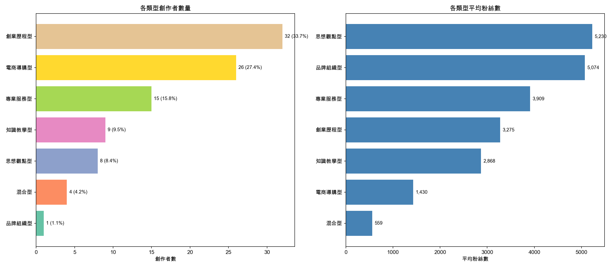
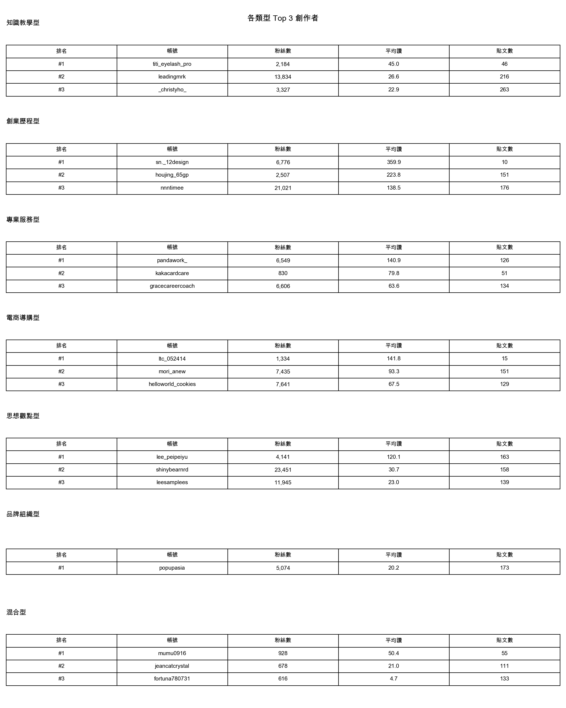

# 創作者分類分析：你該成為哪種類型的創作者？

> 用 AI 分析 95 位 Threads 創作者，找出最適合你的創業帳號經營模式。

---

## 一、關鍵發現

### 創業帳號不是只有一種玩法

我們用 Google Gemini AI 分析了每位創作者的簡介、貼文內容、互動數據和發文頻率，發現 Threads 上的「創業帳號」其實分成 **7 種截然不同的經營模式**——而且表現差異巨大。

**核心結論：說故事的人贏了。**

「創業歷程型」不但是最多人選擇的路線（佔 33.7%），更是互動表現最好的類型，平均按讚數 **52.1**，幾乎是第二名的 1.5 倍。反觀「知識教學型」雖然看似最有價值，互動卻墊底（13.4 讚/篇）。

| 模式         | 一句話描述               | 代表帳號               | 平均讚/篇 |
| ------------ | ------------------------ | ---------------------- | --------- |
| **創業歷程型** | 記錄創業旅程             | sn._12design           | 52.1      |
| **專業服務型** | 用專業接案獲客           | pandawork_             | 33.6      |
| **電商導購型** | 用 Threads 賣商品        | ltc_052414             | 28.0      |
| **思想觀點型** | 分享觀點當意見領袖       | lee_peipeiyu           | 27.0      |
| **品牌組織型** | 公司/組織官方帳號        | popupasia              | 20.2      |
| **混合型**     | 多元內容、沒有固定風格   | mumu0916               | 19.1      |
| **知識教學型** | 教技能賣課程             | titi_eyelash_pro       | 13.4      |

---

## 二、7 種創作者類型

### 2.1 分類方法

| 項目       | 設定                    |
| ---------- | ----------------------- |
| AI 模型    | Google Gemini 2.0 Flash |
| 分類單位   | 每位創作者（非單篇文章）|
| 輸入資料   | 簡介 + 統計數據 + Top 5 貼文 + 文章類別分布 |
| 分類數量   | 7 種類型                |
| 總創作者數 | 95 位                   |

每位創作者由 AI 獨立判斷，輸入包含：個人簡介、粉絲數、平均互動數據、每週發文數，以及互動最高的 5 篇貼文全文。AI 同時回傳信心分數和分類理由。

### 2.2 類型定義

| 類型           | 定義                           | 內容特徵                           | 商業模式             |
| -------------- | ------------------------------ | ---------------------------------- | -------------------- |
| **知識教學型** | 教技能、方法、工具             | 步驟化教學、課程連結、教學系列     | 線上課程、教學服務   |
| **創業歷程型** | 記錄創業/轉職旅程              | 個人敘事、轉折故事、成長記錄       | 個人品牌、諮詢       |
| **專業服務型** | 用專業技能接案/服務客戶        | 領域專業 tips、客戶案例、預約 CTA  | 接案、服務收費       |
| **電商導購型** | 賣實體商品，導流銷售           | 商品照、價格、促銷、預購           | 電商、市集           |
| **思想觀點型** | 分享觀點、趨勢分析             | 評論、產業洞察、熱門議題           | 顧問、演講           |
| **品牌組織型** | 公司/組織帳號，非個人品牌      | 活動公告、品牌推廣、組織訊息       | B2B、活動、品牌      |
| **混合型**     | 無明確主導風格                 | 內容多元、風格不固定               | 尚未找到定位         |

---

## 三、創作者分布

### 3.1 類型統計

| 類型         | 創作者數 | 佔比   | 平均粉絲數 | 總貼文數 | 平均貼文數/人 |
| ------------ | -------- | ------ | ---------- | -------- | ------------- |
| 創業歷程型   | 32       | 33.7%  | 3,275      | 2,589    | 80.9          |
| 電商導購型   | 26       | 27.4%  | 1,430      | 1,761    | 67.7          |
| 專業服務型   | 15       | 15.8%  | 3,909      | 1,914    | 127.6         |
| 知識教學型   | 9        | 9.5%   | 2,868      | 1,115    | 123.9         |
| 思想觀點型   | 8        | 8.4%   | 5,230      | 755      | 94.4          |
| 混合型       | 4        | 4.2%   | 559        | 348      | 87.0          |
| 品牌組織型   | 1        | 1.1%   | 5,074      | 173      | 173.0         |



**解讀：**

- 超過 **60%** 的創業帳號屬於「創業歷程型」或「電商導購型」——前者說故事，後者賣東西，這兩條路最直覺。
- 「專業服務型」和「知識教學型」雖然人數較少，但每人平均貼文數最多（127.6 和 123.9 篇），顯示這兩類創作者更重視持續產出。
- 「思想觀點型」平均粉絲數最高（5,230），但只有 8 位，說明能走這條路的人門檻較高。

### 3.2 各類型成效

| 類型         | 平均讚/篇 | 中位數讚/篇 | 平均回覆/篇 | 平均轉發/篇 | 平均粉絲數 |
| ------------ | --------- | ----------- | ----------- | ----------- | ---------- |
| 創業歷程型   | 52.1      | 28.1        | 12.7        | 1.1         | 3,275      |
| 專業服務型   | 33.6      | 12.4        | 5.2         | 1.0         | 3,909      |
| 電商導購型   | 28.0      | 10.3        | 15.1        | 0.5         | 1,430      |
| 思想觀點型   | 27.0      | 9.1         | 2.9         | 0.7         | 5,230      |
| 品牌組織型   | 20.2      | 8.0         | 4.2         | 0.7         | 5,074      |
| 混合型       | 19.1      | 6.5         | 17.4        | 0.5         | 559        |
| 知識教學型   | 13.4      | 7.6         | 2.2         | 0.6         | 2,868      |


**三個讓人意外的發現：**

1. **創業歷程型大幅領先**：平均 52.1 讚，是知識教學型的 **3.9 倍**。Threads 用戶更愛真實故事，不愛教學文。

2. **電商導購型回覆數最高（15.1）**：雖然讚數不高，但每篇平均 15.1 則回覆——這些是潛在客戶在留言詢問！對電商來說，回覆比按讚更有商業價值。

3. **知識教學型互動墊底（13.4 讚）**：這不代表知識教學不好，而是教學型創作者的商業模式不靠 Threads 互動——他們靠課程連結和電子報轉換，Threads 只是漏斗頂端。

---

## 四、成功模式分析

### 4.1 各類型 Top 3 創作者

> 以下為各類型中平均按讚數最高的創作者。

**創業歷程型 Top 3：**

| 排名 | 帳號              | 粉絲數 | 平均讚 | 貼文數 | 特色                                      |
| ---- | ----------------- | ------ | ------ | ------ | ----------------------------------------- |
| #1   | sn._12design      | 6,776  | 359.9  | 10     | 20歲女大生，從擺攤賣花到設計接案           |
| #2   | houjing_65gp      | 2,507  | 223.8  | 151    | 現炸雞排 65 元，紀錄每日創業實況           |
| #3   | nnntimee          | 21,021 | 138.5  | 176    | 不露臉不拍短影音，只靠文字爆單的甜點店     |

**專業服務型 Top 3：**

| 排名 | 帳號              | 粉絲數 | 平均讚 | 貼文數 | 特色                                      |
| ---- | ----------------- | ------ | ------ | ------ | ----------------------------------------- |
| #1   | pandawork_        | 6,549  | 140.9  | 126    | 平面設計師，分享設計日常和作品             |
| #2   | kakacardcare      | 830    | 79.8   | 51     | 卡片修復師，開創冷門專業市場               |
| #3   | gracecareercoach  | 6,606  | 63.6   | 134    | 芳療師+職涯諮詢師，療癒系專業內容         |

**電商導購型 Top 3：**

| 排名 | 帳號                 | 粉絲數 | 平均讚 | 貼文數 | 特色                                   |
| ---- | -------------------- | ------ | ------ | ------ | -------------------------------------- |
| #1   | ltc_052414           | 1,334  | 141.8  | 15     | 手工奶酪甜點，預約排單制                |
| #2   | mori_anew            | 7,435  | 93.3   | 151    | 中山站服飾選品店，高質感穿搭推薦        |
| #3   | helloworld_cookies   | 7,641  | 67.5   | 129    | 脆脆燕麥專賣，新年禮盒預購             |

**思想觀點型 Top 3：**

| 排名 | 帳號              | 粉絲數 | 平均讚 | 貼文數 | 特色                                      |
| ---- | ----------------- | ------ | ------ | ------ | ----------------------------------------- |
| #1   | lee_peipeiyu      | 4,141  | 120.1  | 163    | 有公司、有相機、愛思考，感受力強的觀察者   |
| #2   | shinybearnrd      | 23,451 | 30.7   | 158    | 畫圖文的熊，分享心情和職場心得             |
| #3   | leesamplees       | 11,945 | 23.0   | 139    | 白天職場生存，晚上經營第二人生             |

**知識教學型 Top 3：**

| 排名 | 帳號              | 粉絲數 | 平均讚 | 貼文數 | 特色                                      |
| ---- | ----------------- | ------ | ------ | ------ | ----------------------------------------- |
| #1   | titi_eyelash_pro  | 2,184  | 45.0   | 46     | 資深睫毛管理導師，線上課程變現             |
| #2   | leadingmrk        | 13,834 | 26.6   | 216    | Notion 全球認證顧問，數位工具教學          |
| #3   | _christyho_       | 3,327  | 22.9   | 263    | 自媒體導師，500+ 學員高效變現             |



### 4.2 成功創作者的共同特徵

跨類型觀察 Top 創作者，我們發現這些共同模式：

1. **明確定位** —— 簡介一看就知道「你是誰、你能提供什麼」。sn._12design 寫的是「20歲女大生 | 從擺攤賣花到設計接案」，不是「喜歡設計的人」。

2. **有「反差感」的故事** —— 表現最好的創業歷程型都有明確反差：女大生做設計接案（年齡反差）、65 元雞排的創業日記（價格反差）、不露臉只靠文字（方法反差）。

3. **穩定產出，而非爆發式發文** —— Top 電商和服務型帳號多為每週 2-5 篇穩定輸出，而非一天 10 篇灌水。

4. **商業模式清楚** —— 不只是發文，每位 Top 創作者都有明確的「變現路徑」：課程、服務、商品、預約。

---

## 五、內容組合分析

### 5.1 各類型創作者都發什麼類型的文章？

我們結合文章分類（第三章）的結果，分析每種創作者類型最常發的文章類別：

| 創作者類型   | 最常發的文章類型    | 第二常見           | 特徵                                |
| ------------ | ------------------ | ------------------ | ----------------------------------- |
| 知識教學型   | 觀點評論           | 教學型             | 意外！教學型創作者的文章以觀點為主   |
| 創業歷程型   | 多元（經驗/觀點/問答）| 生活記錄         | 內容多元，不只說故事                 |
| 專業服務型   | 經驗分享 / 其他    | 觀點評論           | 用經驗建立專業權威                   |
| 電商導購型   | 其他 / 生活記錄    | 問答互動           | 商品文被分類為「其他」，穿插生活文   |
| 思想觀點型   | 觀點評論           | 生活記錄           | 觀點為主，符合預期                   |
| 混合型       | 生活記錄 / 問答互動 | 觀點評論          | 沒有主軸，什麼都發                   |


**給創業者的 3 個啟示：**

- **「知識教學型」不等於只發教學文** —— 數據顯示，成功的教學型帳號反而以「觀點評論」為主。先用觀點吸引注意力，再用教學內容轉換。
- **「創業歷程型」的秘密武器是多元化** —— 他們不只說故事，還會穿插問答互動（拉高回覆）和成果展示（建立信任）。
- **「電商導購型」如果只發商品文，互動會很差** —— 表現好的電商帳號都會加入「生活記錄」和「問答互動」來建立人設和連結。

---

## 六、發文頻率分析

### 6.1 發文頻率 vs 互動表現


從散佈圖可以觀察到：

- **沒有「發越多讚越多」的線性關係** —— 有些每週 20+ 篇的帳號互動極低，有些每週 1-2 篇的帳號互動極高。
- **甜蜜點大約在每週 2-5 篇** —— 多數高互動帳號落在這個區間。
- **電商導購型的發文頻率普遍較高**（需要持續曝光商品），但高頻不等於高互動。

### 6.2 各粉絲級距的互動表現


**關鍵洞察：小帳號的互動率可能更好。**

粉絲數 100-1k 的帳號佔了我們樣本的最大宗（約 39 位），其中不乏互動表現優秀的案例：

- **kakacardcare**（830 粉絲）平均 79.8 讚 —— 證明利基市場可以創造高互動
- **trippstudiotw**（149 粉絲）平均 36.1 讚 —— 創業初期的故事也能引起共鳴
- **smooth._tea**（303 粉絲）平均 36.1 讚 —— 小茶飲店用真誠內容打動人心

**這對新創業者來說是好消息：你不需要萬人追蹤才能有好互動。**

---

## 七、選擇你的創作者類型

### 7.1 決策框架：「你適合哪種類型？」

根據數據分析，我們建議這個決策流程：

```
Q1: 你現在正在做什麼？

  → 正在創業/轉職/開店 → 【創業歷程型】（33.7% 創作者選擇，平均 52.1 讚）
  → 有一技之長，想接案 → 【專業服務型】（15.8%，平均 33.6 讚）
  → 有實體商品要賣   → 【電商導購型】（27.4%，平均 28.0 讚）
  → 有專業知識想教人 → 【知識教學型】（9.5%，平均 13.4 讚，但課程轉換率高）
  → 想當意見領袖     → 【思想觀點型】（8.4%，門檻最高，需要產業經驗）
```

**如果不確定，從「創業歷程型」開始** —— 它是最多人選的路線，互動最好，而且每個人都有故事可以說。

### 7.2 各類型的啟動策略

#### 創業歷程型（推薦指數：⭐⭐⭐⭐⭐）

```
數據表現：33.7% 創作者選擇，平均 52.1 讚/篇
適合：正在創業/轉職的人，有故事可以說
代表案例：houjing_65gp（65元雞排日記，2,507 粉，平均 223.8 讚）
啟動方式：從「我為什麼開始」寫起——離職原因、第一筆訂單、創業第 N 天
關鍵：反差感 + 真實數據（營收、訂單數）
發文頻率：每週 2-4 篇
變現路徑：累積信任 → 諮詢服務 → 社群/課程
```

#### 專業服務型（推薦指數：⭐⭐⭐⭐）

```
數據表現：15.8% 創作者選擇，平均 33.6 讚/篇，平均粉絲最多（3,909）
適合：美業、設計、行銷、諮詢等有一技之長的人
代表案例：pandawork_（平面設計師，6,549 粉，平均 140.9 讚）
啟動方式：分享「客戶常見問題」和「專業小技巧」
關鍵：用作品說話，展示客戶案例
發文頻率：每週 2-3 篇
變現路徑：內容獲客 → 服務收費 → 教學擴展
```

#### 電商導購型（推薦指數：⭐⭐⭐）

```
數據表現：27.4% 創作者選擇，平均 28.0 讚/篇，但回覆數最高（15.1）
適合：有實體商品的店家
代表案例：mori_anew（服飾選品，7,435 粉，平均 93.3 讚）
啟動方式：產品文佔 50%，故事文佔 30%，互動文佔 20%
關鍵：不要只發商品文！加入開店故事和日常
發文頻率：每週 3-5 篇
變現路徑：曝光 → 詢問（回覆）→ 下單
```

#### 知識教學型（推薦指數：⭐⭐⭐）

```
數據表現：9.5% 創作者選擇，平均 13.4 讚/篇（Threads 互動低，但課程轉換率高）
適合：有專業技能、喜歡整理知識的人
代表案例：leadingmrk（Notion 顧問，13,834 粉，幫助 13,000+ 學員）
啟動方式：選一個擅長主題，寫「觀點 + 方法論」而非純步驟教學
關鍵：Threads 是漏斗入口，不是變現主場
發文頻率：每週 3-4 篇
變現路徑：觀點引流 → 電子報 → 線上課程
```

#### 思想觀點型（推薦指數：⭐⭐）

```
數據表現：8.4% 創作者選擇，平均粉絲數最高（5,230）但門檻高
適合：有產業經驗、喜歡評論分析的人
代表案例：lee_peipeiyu（4,141 粉，平均 120.1 讚，感受力強的觀察者）
啟動方式：對熱門議題發表你的獨特角度
關鍵：需要真正的產業經驗和獨特觀點
發文頻率：每週 2-3 篇
變現路徑：建立權威 → 顧問/演講 → 品牌合作
```

### 7.3 避免的 4 個陷阱

| 陷阱                   | 數據佐證                                       | 解法                             |
| ---------------------- | ---------------------------------------------- | -------------------------------- |
| 沒有定位就開始         | 「混合型」平均只有 19.1 讚，最低粉絲數（559）    | 先選一個類型，做 30 天再調整     |
| 只發商品文             | 電商型轉發數僅 0.5（最低），內容不被分享         | 加入故事和問答，商品文佔比 ≤50%  |
| 以為教學文 = 高互動    | 知識教學型平均只有 13.4 讚，互動最低             | 用「觀點」引流，「教學」在課程裡 |
| 追求高頻灌水           | 每週 20+ 篇的帳號互動普遍低於每週 2-5 篇的帳號  | 質量 > 數量，每週 2-5 篇最佳    |

---

## 八、數據說明

### 8.1 資料處理

- **AI 模型**：Google Gemini 2.0 Flash
- **分類方式**：每位創作者獨立分類，輸入簡介 + 數據統計 + Top 5 貼文 + 文章類別分布
- **篩選條件**：排除 >100k 粉帳號、排除 >1000 讚極端爆文、排除空白貼文
- **文章類別來源**：來自第三章的文章分類結果（article-classifications.json）
- **最終樣本**：95 位創作者，8,655 篇貼文

### 8.2 分類限制

- 部分創作者可能處於轉型期，被分到「混合型」（僅 4 位）
- 帳號早期和近期風格可能不同，AI 以整體數據判斷
- 電商帳號若貼文多為圖片（無文字），分類準確度較低
- 品牌組織型僅 1 位（popupasia），不具統計代表性

### 8.3 與其他章節的關聯

| 章節 | 關聯 |
| ---- | ---- |
| 第一章：資料集概覽 | 本章使用相同的篩選條件和粉絲分級 |
| 第三章：文章分類 | 本章讀取文章分類結果，計算每位創作者的「內容組合」 |

---

## 附錄

### A. 分析程式碼

完整分析腳本：[scripts/creator/analysis.py](../scripts/creator/analysis.py)

### B. 執行方式

```bash
# 前置：先執行文章分類（第三章），產出 article-classifications.json
uv run python scripts/article/analysis.py

# 再執行創作者分類
uv run python scripts/creator/analysis.py
```

### C. 輸出檔案

```
scripts/outputs/
├── cache/
│   └── creator-classifications.json        # 創作者分類快取（95 筆）
├── tables/
│   ├── creator-classification.csv          # 完整分類結果（含分類理由）
│   ├── creator-classification-summary.csv  # 7 類型分布摘要
│   ├── creator-classification-engagement.csv # 各類型互動指標
│   └── creator-classification-top.csv      # 各類型 Top 3
└── plots/
    └── creator-classification/
        ├── creator_distribution.png        # 類型分布 + 平均粉絲數
        ├── creator_performance.png         # 按讚/回覆/轉發三面板
        ├── creator_content_mix.png         # 文章類別堆疊圖
        ├── posting_frequency.png           # 發文頻率 vs 互動散佈圖
        ├── engagement_by_tier.png          # 各粉絲級距互動比較
        └── top_creators.png               # 各類型 Top 3 一覽
```

---

**最後更新**：2026-02-06
