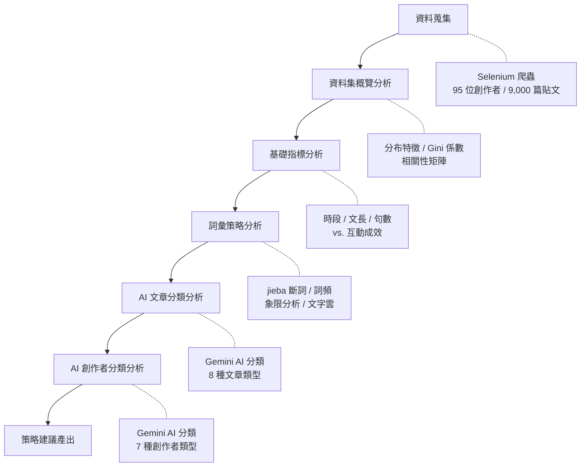
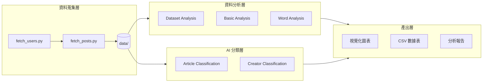
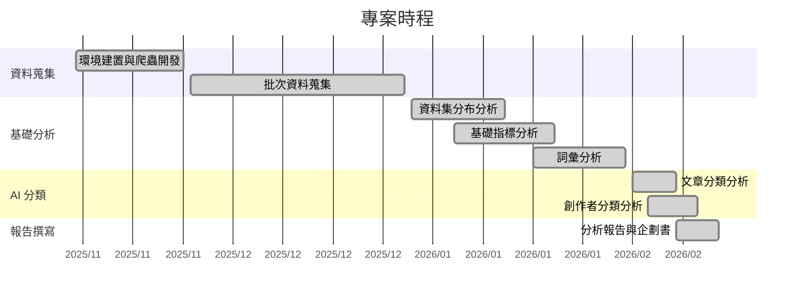

# 企劃書：Threads 中文創作者內容策略分析

> 基於網頁爬蟲與 AI 分類的多維度數據研究

---

## 一、題目主題

### 1.1 研究題目

**Threads 中文創作者內容策略分析——基於爬蟲與 AI 分類的多維度數據研究**

### 1.2 研究背景

Meta 於 2023 年 7 月推出 Threads 社群平台，作為 Twitter（現 X）的直接競爭者。Threads 以文字為核心、強調對話與社群連結，上線五天即突破一億用戶，成為史上成長最快的消費級應用程式。

然而，相較於 Instagram、Facebook 等成熟平台，Threads 的中文內容生態仍處於早期發展階段，具備以下特殊性：

- **演算法尚未穩定**：推薦機制持續迭代，創作者難以依賴過往經驗預判內容成效。
- **中文創作者生態未被系統性研究**：現有的社群經營指南多以英語市場為主，缺乏針對繁體中文市場的數據分析。
- **創業帳號快速湧入**：大量個人品牌與微型創業者將 Threads 視為新的流量入口，但缺乏策略依據。

### 1.3 研究問題

本研究聚焦以下核心問題：

> **什麼樣的內容策略能有效提升中文創作者在 Threads 平台的互動成效？**

具體而言，本研究嘗試回答：

1. Threads 中文創作者的生態分布呈現什麼樣貌？互動資源如何分配？
2. 發文時段、文章長度等基礎維度與互動成效之間是否存在顯著關聯？
3. 哪些詞彙與用語能有效提升貼文互動？不同粉絲量級的創作者是否存在詞彙策略差異？
4. 不同文章類型（教學型、經驗分享、觀點評論等）的互動成效差異為何？
5. 不同創作者經營模式（創業歷程型、專業服務型、電商導購型等）的成功模式有何不同？

### 1.4 研究範圍

| 項目 | 說明 |
|------|------|
| 目標平台 | Threads（threads.net） |
| 分析期間 | 2024 年至 2026 年 |
| 資料規模 | 約 9,000 篇貼文、95 位創作者 |
| 篩選條件 | 排除粉絲數 >100,000 的極端大帳號 |
| 內容語言 | 繁體中文 |
| 時區基準 | 台灣時間（UTC+8） |
| 主題聚焦 | 創業、個人品牌、專業服務等商業導向帳號 |

---

## 二、內容方向

### 2.1 研究架構

本研究採用「資料蒐集 → 統計分析 → AI 分類 → 策略建議」四階段研究架構，由淺入深，逐步拆解 Threads 內容策略的關鍵因子。



### 2.2 五大分析模組

研究內容對應五個獨立且可串接的分析模組：

#### 模組一：資料集分布分析

分析資料集整體分布特徵，建立後續分析的統計基礎。

- 用戶生態：粉絲數分布、發文量分布、長尾效應分析
- 互動指標：按讚、回覆、轉發的分布與集中度
- 不平等度量：Gini 係數計算，量化互動資源的分配不均
- 指標相關性：各維度間的相關性矩陣與共線性分析

#### 模組二：基礎指標分析

探討時間與形式維度對互動成效的影響。

- 時段分析：24 小時分布、時段分群（凌晨/上午/下午/晚間）、商業時段效益
- 內容形式：文章長度區間（短文/中篇/長文）、句子數量對互動的影響
- 交叉比較：各維度與按讚、回覆、轉發的交叉成效比較

#### 模組三：詞彙策略分析

運用中文自然語言處理技術，分析文字內容與互動成效的關聯。

- 詞頻統計：jieba 斷詞後的詞頻排序與文字雲
- 高互動詞彙：識別出現在高互動貼文中的關鍵詞彙
- 象限分析：以使用頻率與互動成效為雙軸，將詞彙分為明星詞、藍海詞、紅海詞、地雷詞
- 分層差異：依粉絲量級（0-100 / 100-1k / 1k-10k / 10k-100k）分層比較詞彙策略差異

#### 模組四：文章分類分析

運用生成式 AI 對貼文進行內容類型分類，分析各類型的成效差異。

- 分類體系：教學型 / 經驗分享 / 觀點評論 / 資源整理 / 問答互動 / 成果展示 / 生活記錄 / 其他
- 成效排名：各類別的互動指標比較
- 交叉分析：文章類型 × 發文時段、文章類型 × 文章長度的最佳組合

#### 模組五：創作者分類分析

運用生成式 AI 對創作者進行經營模式分類，歸納成功模式。

- 分類體系：知識教學型 / 創業歷程型 / 專業服務型 / 電商導購型 / 思想觀點型 / 品牌組織型 / 混合型
- 成效比較：各類型的互動成效與內容組合分析
- 成功模式：各類型 Top 創作者的共同特徵與策略
- 決策建議：依創作者背景推薦適合的經營模式

### 2.3 研究方法

| 方法 | 應用範圍 | 說明 |
|------|---------|------|
| 網頁爬蟲 | 資料蒐集 | Selenium 模擬瀏覽器行為，繞過動態載入機制 |
| 描述性統計 | 模組一至三 | 分布分析、集中趨勢、離散程度、相關性分析 |
| 中文 NLP | 模組三 | jieba 斷詞、停用詞過濾、詞頻統計 |
| 生成式 AI 分類 | 模組四至五 | Google Gemini 進行非監督式內容分類 |
| 交叉分析 | 全模組 | 多維度交叉比對，找出最佳策略組合 |

---

## 三、主要技術

### 3.1 系統架構



### 3.2 技術棧總覽

| 技術層 | 技術 | 用途 |
|--------|------|------|
| **資料蒐集** | Selenium | 瀏覽器自動化，模擬使用者行為爬取動態頁面 |
| | BeautifulSoup4 | HTML 解析，從頁面結構中擷取結構化資料 |
| | Pydantic | 資料模型驗證，確保爬取資料的結構一致性 |
| **資料分析** | pandas | 資料清洗、轉換、聚合與統計分析 |
| | matplotlib | 基礎視覺化，圖表繪製與中文字型支援 |
| | seaborn | 統計視覺化，熱力圖與分布圖 |
| **中文處理** | jieba | 中文斷詞，支援自訂詞典與停用詞 |
| | wordcloud | 文字雲生成 |
| **AI 分類** | Google Gemini API | 生成式 AI 內容分類（文章類型 / 創作者類型） |
| **工程基礎** | Python 3.12+ | 主要開發語言 |
| | uv | 套件管理與虛擬環境 |
| | python-dotenv | 環境變數管理 |
| | loguru | 結構化日誌 |

### 3.3 關鍵技術細節

#### 爬蟲策略

- **Cookie 驗證**：首次手動登入後儲存 Cookie，後續自動載入，避免重複登入。
- **動態滾動載入**：Threads 採用無限滾動機制，爬蟲以增量滾動方式逐步觸發內容載入。
- **請求間隔控制**：每次請求間隔 10 秒，降低被反爬蟲機制偵測的風險。
- **資料去重**：以貼文 ID 為主鍵進行去重，避免重複滾動造成的資料重複。

#### AI 分類機制

- **模型選擇**：Google Gemini 2.0 Flash，兼顧分類品質與 API 呼叫成本。
- **快取機制**：分類結果存入 JSON 快取，避免重複呼叫 API，降低成本並加速二次分析。
- **輸入設計**：結合創作者簡介、統計數據、Top 5 高互動貼文全文，提供充足上下文供 AI 判斷。
- **信心評分**：AI 回傳分類結果時附帶信心分數與分類理由，供人工審核。

#### 資料處理

- **文本清洗**：移除 Instagram 附帶的元資料噪音（如「已靜音」、「更多」等介面文字）。
- **極端值處理**：移除 >1,000 讚的極端爆文，避免少數離群值扭曲分析結果。
- **分層分析**：依粉絲量級分為 0-100 / 100-1k / 1k-10k / 10k-100k 四個層級，確保分析結論對不同規模的創作者均具參考價值。

### 3.4 資料模型

核心資料結構以 Pydantic 定義，確保型別安全與資料一致性：

```python
class Profile(BaseModel):
    username: str
    full_name: Optional[str]
    followers: Optional[int]
    bio: Optional[str]
    bio_links: List[str]

class ThreadPost(BaseModel):
    id: str
    text: str
    url: str
    posted_at: Optional[str]
    like_count: int
    reply_count: int
    repost_count: int
    forward_count: Optional[int]

class ThreadsSnapshot(BaseModel):
    profile: Profile
    posts: List[ThreadPost]
```

---

## 四、時程規劃

### 4.1 專案時程表

本專案於 2025 年 11 月啟動，歷時約 3 個月完成全部開發與分析工作。

| 階段 | 期間 | 工作內容 | 產出 |
|------|------|---------|------|
| **Phase 1：環境建置與爬蟲開發** | 2025/11 | 建立專案結構、開發使用者搜尋與貼文爬取模組、實作 Cookie 驗證與動態滾動機制 | `fetch_users.py`、`fetch_posts.py` |
| **Phase 2：資料蒐集** | 2025/12 | 依關鍵字搜尋目標創作者、批次爬取約 95 位創作者的個人檔案與歷史貼文 | `data/` 目錄，約 9,000 篇貼文 |
| **Phase 3：基礎分析模組** | 2026/01 上旬 | 開發共用工具模組、資料集分布分析、基礎指標分析（時段/文長/句數） | Dataset Analysis、Basic Analysis |
| **Phase 4：詞彙分析模組** | 2026/01 下旬 | 中文斷詞整合、詞頻統計、象限分析、文字雲生成、分層詞彙差異分析 | Word Analysis |
| **Phase 5：AI 分類模組** | 2026/02 上旬 | 串接 Google Gemini API、開發文章分類與創作者分類、實作快取機制 | Article Classification、Creator Classification |
| **Phase 6：報告撰寫與彙整** | 2026/02 中旬 | 撰寫五份分析報告、整理視覺化圖表、彙整策略建議 | `docs/` 分析報告 |

### 4.2 甘特圖



### 4.3 里程碑

| 里程碑 | 預定日期 | 完成狀態 |
|--------|---------|---------|
| 爬蟲模組開發完成 | 2025/11/30 | 已完成 |
| 資料蒐集完成（95 位創作者） | 2025/12/31 | 已完成 |
| 三項基礎分析模組完成 | 2026/01/31 | 已完成 |
| AI 分類模組完成 | 2026/02/10 | 已完成 |
| 全部分析報告完成 | 2026/02/13 | 已完成 |

---

## 五、預期成果

### 5.1 量化產出

| 類別 | 項目 | 數量 |
|------|------|------|
| 分析報告 | 完整分析報告（Markdown） | 5 份 |
| 視覺化圖表 | 分布圖、箱型圖、熱力圖、散佈圖、文字雲等 | 30+ 張 |
| 數據報表 | CSV 格式統計報表 | 10+ 份 |
| AI 分類結果 | 文章分類（8 類）、創作者分類（7 類） | 2 套 |
| 程式碼模組 | 爬蟲模組 + 分析腳本 + 共用工具 | 7 支 |

### 5.2 研究發現

本研究預期產出以下關鍵洞察：

**資料集層面**

- 量化 Threads 中文創作者生態的不平等程度（Gini 係數），揭示互動資源的分配結構。
- 確認互動數據的長尾分布特徵，提出以中位數取代平均值的分析建議。

**策略層面**

- 識別最佳發文時段與內容長度，提供可操作的排程建議。
- 建立詞彙象限模型（明星詞 / 藍海詞 / 紅海詞 / 地雷詞），指引文案用字策略。
- 量化各文章類型的互動成效差異，建議最佳內容類型組合。
- 歸納各創作者類型的成功模式，提供經營模式選擇的決策框架。

**方法論層面**

- 驗證生成式 AI（Google Gemini）應用於社群內容分類的可行性與效果。
- 建立可重現的分析流程，所有腳本皆可一鍵執行。

### 5.3 可交付成果

```
docs/
├── proposal.md                    # 本企劃書
├── README.md                      # 分析報告總覽
├── 00-dataset-analysis.md         # 資料集分布分析報告
├── 01-basic-analysis.md           # 基礎指標分析報告
├── 02-word-analysis.md            # 詞彙分析報告
├── 03-article-classification.md   # 文章分類分析報告
└── 04-creator-classification.md   # 創作者分類分析報告

scripts/outputs/
├── plots/                         # 視覺化圖表（PNG）
├── tables/                        # 數據報表（CSV）
└── cache/                         # AI 分類快取（JSON）
```

### 5.4 延伸價值

本研究建立的技術框架與分析方法具備以下延伸可能性：

1. **跨平台擴展**：爬蟲架構可調整應用於 Instagram、X（Twitter）等平台，進行跨平台內容策略比較。
2. **時間序列追蹤**：定期重新爬取資料，追蹤 Threads 演算法變化對內容成效的影響。
3. **自動化建議系統**：基於分析結果，開發自動化的內容策略建議工具。
4. **樣本擴展**：擴大爬取範圍至更多創作者與產業別，提升分析結論的普適性。

---

## 附錄

### A. 專案結構

```
scrapper/
├── fetch_users.py              # 使用者搜尋爬蟲
├── fetch_posts.py              # 貼文爬取爬蟲
├── scripts/
│   ├── shared/utils.py         # 共用工具（資料載入、文本清洗、中文字型）
│   ├── dataset/analysis.py     # 資料集分布分析
│   ├── basic/analysis.py       # 基礎指標分析
│   ├── word/analysis.py        # 詞彙分析
│   ├── article/analysis.py     # 文章分類分析
│   └── creator/analysis.py     # 創作者分類分析
├── docs/                       # 分析報告（GitBook 格式）
├── data/                       # 爬取資料（gitignored）
└── scripts/outputs/            # 分析產出（圖表 / 報表 / 快取）
```

### B. 環境需求

| 項目 | 版本 / 說明 |
|------|------------|
| Python | 3.12+ |
| Chrome | 與 ChromeDriver 版本相符 |
| Google Gemini API Key | AI 分類功能所需 |
| 作業系統 | macOS（ARM64）/ Linux |

### C. 重現步驟

```bash
# 1. 安裝依賴
uv sync

# 2. 設定環境變數
cp .env.example .env
# 編輯 .env，填入 Gemini API Key

# 3. 執行分析（依序）
python scripts/dataset/analysis.py
python scripts/basic/analysis.py
python scripts/word/analysis.py
python scripts/article/analysis.py    # 需要 Gemini API Key
python scripts/creator/analysis.py    # 需要 Gemini API Key
```

---

**撰寫日期**：2026-02-13
